# 1. EFFECTIVE FEATURE DESIGN

## 1.1 Feature Definition
* **Noun (The Tool):** `AppVolatilityAnalyzer` (CLI Tool)
    * **Core Function:** A Python-based ETL pipeline that orchestrates the Apify `agents/appstore-reviews` Actor, ingests raw JSON, performs statistical analysis (Trend/Slope/Keyword Density) using Pandas, and outputs a "Risk Scorecard" for target apps.

## 1.2 Effectiveness Attributes
* **Sustainability Adjectives (Robustness):**
    * *Adjective:* **Deterministic** (Math-Based)
        * *Implementation:* All scoring logic uses standard deviation, linear regression slopes, and keyword frequency counts. No LLM probabilistic generation is used for metrics.
    * *Adjective:* **Fault-Tolerant** (Apify Wrappers)
        * *Implementation:* Wrap API calls in `tenacity` retry blocks to handle network jitters. Fail gracefully if an App ID is invalid (log error, continue to next app).

* **Efficiency Adjectives (Optimization):**
    * *Adjective:* **Vectorized** (High Speed)
        * *Implementation:* Use `pandas` vector operations for text searching and date filtering instead of iterating through Python lists.
    * *Adjective:* **Thrifty** (Token Conservation)
        * *Implementation:* Filtering happens *in-memory* immediately after fetch. We do not persist generic 5-star reviews to disk, saving storage and visual noise.

* **Scalability Adjectives (Volume):**
    * *Adjective:* **Config-Driven** (Batch Processing)
        * *Implementation:* The system accepts a `targets.json` array, allowing the user to scan 1, 10, or 50 apps in a single command.
    * *Adjective:* **Polylingual** (Global Reach)
        * *Implementation:* `pain_keywords.json` supports arrays of strings, enabling English/Vietnamese detection simultaneously without code changes.

## 1.3 Architecture & Data

### Visual Map (Mermaid)

```mermaid
graph TD
    User[User / CLI] -->|runs| Main[main.py]
    
    subgraph "Phase 1 & 2: ETL"
        Main -->|orchestrates| Fetcher[Fetcher Class]
        Fetcher -->|calls| Apify[agents/appstore-reviews]
        Apify -->|returns| Raw[Raw Reviews JSON]
    end
    
    subgraph "Phase 3: Analysis"
        Main -->|feeds JSON| Analyzer[Analyzer Class]
        Analyzer -->|calculates| Pandas[Pandas/NumPy]
        Pandas -->|outputs| GapSchema["data/{niche}/{app}_analysis.json"]
    end

    subgraph "Phase 4: Forensic Intelligence (T-008)"
        Analyzer -->|passes reviews_df| Forensic[ForensicAnalyzer]
        Forensic -->|computes| NGrams[Scikit-Learn N-Grams]
        Forensic -->|detects| Anomalies[Time-Series Events]
        Forensic -->|name_spike| NamedSpikes[Named Spikes]
        Forensic -->|outputs| MatrixJSON["reports/{niche}/niche_matrix.json"]
        Forensic -->|outputs| IntelJSON["reports/{niche}/{app}_intelligence.json"]
    end
    
    subgraph "Phase 5: Reporting"
        Main -->|feeds schema_app_gap + IntelJSON| Reporter[Reporter Class]
        Reporter -->|writes| MD["reports/{niche}/report_*.md"]
    end

    subgraph "Phase 6: Predictive Analytics"
        GapSchema -->|schema_app_gap| SlopeDelta[SlopeDeltaCalculator]
        SlopeDelta -->|Slope_T1 vs Slope_T2| DeltaMetric["Δm (Acceleration)"]
        GapSchema -->|schema_app_gap| Fermi[FermiEstimator]
        Fermi -->|Review_Vol, Price, Multiplier| LeakageUSD["Monthly_Leakage_USD"]
    end

    subgraph "Phase 7: Venture Architect (The Anthropologist)"
        Main -->|raw reviews + analysis| VA[VentureArchitect]
        VA -->|extracts| PainSig["Pain Signal (1-2★)"]
        VA -->|extracts| SuccessSig["Success Signal (5★ Whales)"]
        RedditFetcher[fetcher_reddit.py] -->|apify/reddit-scraper| ContextSig["Context Signal (Reddit)"]
        ContextSig --> VA

        VA -->|Stage 1| ICP["Holographic ICP (JSON)"]
        VA -->|Stage 2| SysMap["7-Node System Dynamics Map (JSON)"]
        VA -->|Stage 3| EPS["EPS Prescription (JSON)"]

        ICP --> SysMap --> EPS

        VA -->|orchestrates| AIClient[ai_client.py LLM]
        AIClient -->|Gemini structured output| VA

        VA -->|renders| Blueprint["reports/{niche}/venture_blueprint_{app}.md"]
        VA -->|saves| SysMapJSON["reports/{niche}/{app}_system_map.json"]
    end
```



### Data Models (Schema)

**1. Input Configuration (`config/targets.json`)**

| Field | Type | Description |
| :--- | :--- | :--- |
| `niche_name` | string | Niche identifier; used for `data/{niche_name}/` and `reports/{niche_name}/` subdirectories. |
| `niche_category` | string | Optional. Fermi multiplier: "b2b", "utility", "consumer", "game". |
| `apps` | array | List of app objects with `name`, `url`, optional `price`, optional `niche_category`. |
| `params` | object | Fetch parameters: `days_back`, `max_reviews`, `language`, `country`. |

```json
{
  "niche_name": "Tattoo_AI",
  "apps": [
    { "name": "CompetitorX", "url": "https://apps.apple.com/...", "price": 4.99 },
    { "name": "IncumbentY", "url": "https://apps.apple.com/..." }
  ],
  "params": {
    "days_back": 90,
    "max_reviews": 500,
    "language": "en"
  }
}
```

**2. System Settings (`config/settings.json`)**

Controls "Thrifty" filters and Risk Score weights. Values are configurable; examples below.

```json
{
  "filters": {
    "min_star_rating": 1,
    "min_review_length_words": 1,
    "drop_generic_5_star": true,
    "force_fetch_count": 500,
    "country": "us"
  },
  "weights": {
    "slope_impact": 20.0,
    "volume_impact": 0.5,
    "critical_keyword": 10.0,
    "scam_keyword": 8.0,
    "performance_keyword": 5.0,
    "ux_keyword": 2.0
  },
  "processing": {
    "enable_smoke_test": false,
    "days_back_default": 90
  }
}

**4. The Output Artifact (schema_app_gap.json)**

This is the "Truth Source" generated by the Python script.

```json
{
  "app_name": "CompetitorX",
  "analysis_date": "2023-10-27",
  "metrics": {
    "total_reviews_90d": 150,
    "negative_ratio": 0.45,
    "volatility_slope": 0.8,
    "risk_score": 78.5
  },
  "signals": {
    "broken_update_detected": true,
    "suspected_version": "5.2.1",
    "top_pain_categories": [
      { "category": "scam_financial", "count": 18, "weight": 8 },
      { "category": "critical", "count": 12, "weight": 10 }
    ],
    "pillar_densities": { "Functional": 0.43, "Economic": 2.77, "Experience": 0.55 },
    "primary_pillar": "Economic",
    "monthly_leakage_usd": 49950.0,
    "slope_delta": -1.9,
    "slope_delta_insight": "Stabilizing: -105.6% week-over-week"
  },
  "evidence": [
    "Raw text of review 1...",
    "Raw text of review 2..."
  ]
}
```

**5. The Scoring Formula (LaTeX)**
The risk_score is calculated as a composite index:$$RiskScore = \min(100, (W_{slope} \times S) + (W_{vol} \times V) + \sum (C_i \times W_i))$$Where:
Trend Impact ($S$): $W_{slope} = 20$. If slope > 0.5, score +20.
Volume Impact ($V$): $W_{vol} = 0.5$. If 50 negative reviews, score +25.
Pain Impact ($\sum$): Sum of (Count of Category $i$ $\times$ Weight of Category $i$).
Example: 2 Crashes ($2 \times 10$) + 3 Lags ($3 \times 5$) = 35 points.

## 1.4 Resource Impact Analysis

**Financial Impact (OpEx)**
External Costs: Apify `agents/appstore-reviews` (primary); fallback to `thewolves/appstore-reviews-scraper` if needed.

Cost per run: ~$0.10 - $0.20 per 1,000 reviews.

Projected Run Rate: For 10 apps/week -> <$2.00/month (Well within the $5.00 limit).

Compute: Local (Free).

**Build Cost (One-Time)**
Time to Build: Low (1-2 Days).

Day 1: Apify Integration & Pandas Logic (with Regex).

Day 2: Report Formatting & Testing.

Complexity Risk: Low.

Main risk is Apify changing their output schema (mitigated by strictly typing the inputs).

**ROI Sanity Check**
Value Proposition: Manually analyzing 500 reviews takes ~4 hours. This script does it in 30 seconds with mathematical consistency across languages.

Alignment: Perfectly fits the "Efficiency" constraint by automating the "Discovery" phase of the Venture Builder.

---

# 2. FORENSIC ARCHITECTURE & LOGIC UPGRADE (Phase 4)

To support the "Irrefutable Evidence" requirements (T-008), the system architecture extends beyond simple counting into **pattern recognition** and **comparative intelligence**.

## 2.1 New Component: `src/intelligence.py`
* **Class:** `ForensicAnalyzer`
* **Responsibility:** Intermediate processing layer between `Analyzer` (Statistics) and `Reporter` (Markdown). It derives *meaning* from the raw stats.
* **Key Methods:**
    * `detect_event_timeline(reviews_df)`: 
        * *Logic:* Resamples data by Week (`W-MON`). Calculates `Pain Density` per week (Whale reviews contribute 3x). Flags anomalies where Density > μ + 2σ.
        * *Output:* `List[Dict]` -> `[{week: "2023-42", density: 0.85, event: "Critical Spike" or "The Version X Spike", version?: "X"}]`
    * `name_spike(anomaly_week, reviews_df)`:
        * *Logic:* Correlates anomaly weeks (PainDensity > μ + 2σ) with `version` metadata from `reviews_df`. If version strings are present, assigns narrative label (e.g., "The Version 4.2 Crash"). Falls back to dominant topic cluster if no version data.
        * *Output:* `Dict` -> `{week: "2023-42", label: "The Version 4.2 Crash", version: "4.2"}` for inclusion in forensic intelligence JSON.
    * `extract_semantic_clusters(text_series)`:
        * *Logic:* Uses `sklearn.CountVectorizer` (N-Grams=2,3) on 1-2 star reviews.
        * *Stop Words:* Custom list + App Name filtering.
        * *Output:* `List[Tuple]` -> `[("connection failed", 45), ("premium locked", 32)]`
    * `map_competitor_migration(text_series, competitors_list)`:
        * *Logic:* Regex search for competitor names in "Longing" (positive context) or "Hating" (negative context) proximity.

## 2.2 Updated Scoring Logic (MECE Alignment)

To ensure consistency between `pain_keywords.json` and the scoring logic, the Forensic Analyzer must map keywords to pillars as follows:

| MECE Pillar | Config Categories (must exist in pain_keywords.json) |
| :--- | :--- |
| **Functional** | `critical`, `performance`, `privacy`, `ai_quality` |
| **Economic** | `scam_financial`, `subscription`, `broken_promise`, `ads` |
| **Experience** | `usability`, `generic_pain` |

* **`competitor_mention`:** A *calculated field*, not a keyword category. Derived by `ForensicAnalyzer.map_competitor_migration()` from regex matches of competitor names in review text (e.g., "switched to [App B]"). Mapped to Experience pillar in the niche matrix. No entry in `pain_keywords.json` required.*

*Note: If `ads` or `generic_pain` are missing from the JSON config, the Analyzer should default their weight to 0 and log a warning, rather than crashing.*

## 2.3 Expanded Data Schema (`reports/`)

The system now generates specific JSON artifacts to decouple analysis from reporting, ensuring "Forensic" data is preserved before being rendered into Markdown.

### A. Output Paths (Dynamic Niche Directories)

All outputs use `{niche_name}` from `targets.json` to create subdirectories:

| Artifact | Path | Description |
| :--- | :--- | :--- |
| Analysis | `data/{niche_name}/{app}_analysis.json` | schema_app_gap structure per app. |
| Raw Reviews | `data/{niche_name}/{app}_reviews.json` | Cached raw reviews from Apify. |
| Forensic Intel | `reports/{niche_name}/{app}_intelligence.json` | Per-app forensic data (timeline, N-Grams, migration). |
| Niche Matrix | `reports/{niche_name}/niche_matrix.json` | Comparative MECE pillar scores. |
| Individual Report | `reports/{niche_name}/report_{APP}_{YYYY-MM-DD}.md` | Per-app dossier. |
| Niche Report | `reports/{niche_name}/report_NICHE_{NAME}_{YYYY-MM-DD}.md` | Battlefield heatmap + migration flow. |
| Market Leaderboard | `data/{niche_name}/market_leaderboard.md` | Ranked by Revenue Leakage; Momentum, Risk Score columns. |
| Venture Blueprint | `reports/{niche_name}/venture_blueprint_{app}.md` | Phase 7: Holographic ICP + System Dynamics Map + EPS Prescription. |
| System Map JSON | `reports/{niche_name}/{app}_system_map.json` | Phase 7: Machine-readable ICP, 7-Node map, and EPS data. |

### B. Forensic Matrix (`reports/{niche_name}/niche_matrix.json`)
* **Purpose:** Acts as the structured data source for the "Feature/Fail" Heatmap in the Niche Report.
* **Schema:**
  ```json
  {
    "App Name A": {
      "Functional": 85.5,
      "Economic": 20.0,
      "Experience": 15.0
    },
    "App Name B": {
      "Functional": 10.0,
      "Economic": 95.0,
      "Experience": 40.0
    }
  }
  ```
* **Data Flow:** Generated by `ForensicAnalyzer.generate_matrix()` → Consumed by `Reporter.generate_niche_report()`.

### C. Markdown Reports (The "Dossiers")
* **Individual Report:** `reports/{niche_name}/report_{APP}_{YYYY-MM-DD}.md`
    * Content: Executive Verdict, **Financial Impact** (Estimated Monthly Revenue Leakage, Trend Acceleration), ASCII Timeline Chart (exhibit title from Named Spike when available), Top 3 N-Grams, Verified Quotes. Evidence prioritizes Whale reviews (3x weight).
* **Niche Report:** `reports/{niche_name}/report_NICHE_{NAME}_{YYYY-MM-DD}.md`
    * Content: The "Battlefield" Heatmap (visualizing the Matrix JSON), Migration Flow, and "White Space" Analysis.

### D. White Space / Safe Harbor (T-017)
* **Criteria:** An app is a Safe Harbor only if Functional < 30 AND Economic < 30 (from niche_matrix) **AND** risk_score < 50 (from analyses). High risk_score disqualifies even when pillars are low.
* **Output:** "Gap Found: [app names]" or "No Gap" in the Niche Report.

---

# 3. PHASE 6: PREDICTIVE ANALYTICS (The Oracle)

**Status:** Ready for Execution. Phase 6 adds Trend Forecasting and Revenue Estimation atop the existing Analyzer/Forensic pipeline.

## 3.1 Trend Forecasting (SlopeDeltaCalculator)

* **Component:** `SlopeDeltaCalculator` (within `Analyzer` or `src/analyzer.py`).
* **Logic:** Compare Slope(Last 4 Weeks) vs Slope(Previous 4 Weeks) to compute **Slope Delta** (Δm).
* **Inputs:** Time-series of negative review volume per week (from `reviews_df` or `schema_app_gap`).
* **Output:** Δm value + human-readable insight: "Acceleration Detected: +15% week-over-week" or "Stabilizing: -8% week-over-week."

| Metric | Formula | Interpretation |
| :--- | :--- | :--- |
| Slope_T1 | Linear regression (Last 4 weeks) | Recent trend |
| Slope_T2 | Linear regression (Weeks 5–8) | Prior trend |
| Δm | Slope_T1 − Slope_T2 | Positive = accelerating decline; Negative = stabilizing |

### 3.1.1 Momentum Labels (T-021 Refined)
Used in Leaderboard and reports. Derived from `volatility_slope` and `slope_delta`:
| Condition | Label |
| :--- | :--- |
| volatility_slope > 0.1, slope_delta > 0 | 🚀 Accelerating Pain |
| volatility_slope > 0.1, slope_delta < 0 | 📉 Decelerating Pain |
| -0.05 ≤ volatility_slope ≤ 0.05 | 📉 Stabilizing |
| volatility_slope < -0.05 | 📈 Improving |

## 3.2 Revenue Estimation (FermiEstimator)

* **Component:** `FermiEstimator` (within `Analyzer` or `src/analyzer.py`).
* **Logic:** Fermi-style estimation of monthly revenue leakage from churn signals.
* **Formula:** $Leakage = (Churn\_Reviews \times Multiplier) \times Avg\_Price$

| Input | Source | Description |
| :--- | :--- | :--- |
| Churn_Reviews | `schema_app_gap` (top_pain_categories) | Count of reviews with "Economic" or "Functional" pain pillars |
| Avg_Price | `targets.json` (app.price) or default $9.99 | App price or IAP average |
| Multiplier | `targets.json` (niche_category) | B2B: 50; Consumer: 100; Games: 200+ |

* **Output:** `Monthly_Leakage_USD` (float) — included in `schema_app_gap.signals` or forensic intelligence JSON.

## 3.3 Named Spikes (ForensicAnalyzer Extension)

* **Location:** `ForensicAnalyzer.name_spike()` (see §2.1).
* **Logic:** Correlate anomaly weeks (PainDensity > μ + 2σ) with `version` metadata from `reviews_df`. Assign narrative label (e.g., "The Version 4.2 Crash") for marketing/copy opportunities.
* **Output:** Appended to `reports/{niche}/{app}_intelligence.json` timeline events. Used for exhibit title (e.g., "Exhibit A: The Version 4.2 Crisis") when present.

## 3.4 Whale Detector (T-023)
* **Location:** `ForensicAnalyzer` (Pain Density) and `Analyzer` (Evidence ranking).
* **Logic:** A review is a "Whale" if it has > 40 words OR contains domain vocabulary (e.g., "latency", "vector", "workflow", "sync", "export", "credits", "quota").
* **Multiplier:** 3.0x (`WHALE_MULTIPLIER`). Whale reviews contribute 3x to weekly Pain Density and are prioritized in evidence ranking.

## 3.5 Reporter Integration (T-024)
* **Individual Report:** Financial Impact section (monthly_leakage_usd, slope_delta_insight); Named Spike exhibit title.
* **Leaderboard:** Primary sort by `monthly_leakage_usd`; Revenue Leakage ($/mo) and Momentum columns.
* **Path:** `data/{niche_name}/market_leaderboard.md`.

---

# 4. PHASE 7: THE VENTURE ARCHITECT (The Anthropologist Engine)

**Status:** Ready for Execution. Phase 7 constructs a "Holographic ICP" and prescribes an EPS Solution System by triangulating Pain, Success, and Context signals through a 3-stage LLM pipeline.

## 4.1 Problem Space

* **Core Pain Point:** Phase 6 tells us *where* the money is leaking, but not *who* the human is or *how* to build a better system for them.
* **The Gap:** Founders see "bad reviews" but cannot infer the **Ultimate Desired Outcome (UDO)**, the biological/psychological forces driving/blocking it, or the strategic principles needed to solve it.
* **The Pivot:** We must analyze **Success** (Why they stay — 5★ whales) as deeply as **Failure** (Why they leave — 1-2★), then contextualize with **Reddit** (What they actually do).

## 4.2 Three Data Signals (MECE Inputs)

The Venture Architect requires three *mutually exclusive, collectively exhaustive* data inputs:

| Signal | Source | Filter | Reveals |
| :--- | :--- | :--- | :--- |
| **Pain Signal** | 1-2★ App Store reviews | Already available from `filtered_reviews` | Blockers (UBS), symptoms, churn triggers |
| **Success Signal** | 5★ App Store reviews | Length > 30 words (ignore "Great app") | Drivers (UDS), "Aha Moments", what works |
| **Context Signal** | Reddit threads | Subreddits related to niche | Alternatives, real-world hacks, where app fits in user's life |

### 4.2.1 Success Signal Extraction (Critical Design Point)

**Problem:** The current pipeline drops 5★ reviews via `Fetcher.filter_reviews()` (`drop_generic_5_star: true`). Phase 7 needs them.

**Solution:** `main.py` already has the raw `reviews` list (pre-filter). Pass this to `VentureArchitect`, which internally extracts the Success Signal:

```python
# In VentureArchitect._extract_success_reviews(raw_reviews)
success_reviews = [
    r for r in raw_reviews
    if r.get("rating", 0) >= 5
    and len(r.get("text", "").split()) > 30
]
```

**Verification:** This filter rejects generic 5★ ("Great app", "Love it") but retains narrative reviews that explain *why* the app changed their life. These are the "Whale" success reviews.

## 4.3 Components

### A. `src/venture_architect.py` — VentureArchitect (The Orchestrator)

* **Class:** `VentureArchitect`
* **Responsibility:** 3-stage LLM pipeline that ingests triangulated signals and outputs a Venture Blueprint.
* **Dependencies:** `AIClient`, `RedditFetcher`, existing `schema_app_gap` + `intelligence.json`.

#### Constructor

```python
class VentureArchitect:
    def __init__(
        self,
        ai_client: AIClient,
        pain_keywords_path: Path,
        settings: Optional[Dict] = None,
    ):
        """
        Args:
            ai_client: Initialized AIClient (Gemini/OpenAI wrapper).
            pain_keywords_path: Path to pain_keywords.json (for pillar mapping context).
            settings: Optional venture_architect settings from settings.json.
        """
```

#### Method 1: `construct_holographic_icp`

```python
def construct_holographic_icp(
    self,
    pain_reviews: List[Dict],
    success_reviews: List[Dict],
    reddit_data: List[Dict],
    analysis: Dict,
    app_name: str,
) -> Dict[str, Any]:
    """
    Stage 1: Triangulate three signals into a Holographic ICP.

    Steps:
        1. Extract top Pain themes (from analysis.signals.top_pain_categories).
        2. Extract top Success themes (cluster 5★ whale text by topic).
        3. Extract Context themes (Reddit alternatives, workflows, triggers).
        4. Build LLM prompt with all three signal summaries.
        5. Call AIClient with ICP_SYSTEM_PROMPT (see §4.6.1).
        6. Parse structured JSON response.

    Returns:
        Dict with keys: who, why_udo, what_how_workflow, when_trigger,
                        alternatives, icp_segment (casual vs pro),
                        pain_success_paradox (e.g., "Too complex" vs "Love the depth").
    """
```

**ICP Output Schema:**
```json
{
  "who": {
    "demographic": "25-40, health-conscious professionals",
    "psychographic": "Optimization-driven, data-oriented, time-poor"
  },
  "why_udo": "Not weight loss, but effortless metabolic control that frees cognitive load",
  "what_how_workflow": [
    "Step 1: Open app when starting fast",
    "Step 2: Check timer during meals",
    "Step 3: Log weight weekly"
  ],
  "when_trigger": "After dinner, planning next-day meals; while grocery shopping",
  "alternatives": ["Spreadsheets", "Pen & paper", "Competitor X timer-only"],
  "icp_segment": {
    "primary": "Casual Optimizer (70%)",
    "secondary": "Biohacker Pro (30%)",
    "whale_segment": "Biohacker Pro"
  },
  "pain_success_paradox": {
    "pain_says": "Too complex, too many features",
    "success_says": "Love the depth and data export",
    "inference": "ICP is split — Casual users churn, Pro users are whales"
  }
}
```

#### Method 2: `map_system_dynamics`

```python
def map_system_dynamics(
    self,
    icp: Dict[str, Any],
    pain_reviews: List[Dict],
    success_reviews: List[Dict],
    analysis: Dict,
    app_name: str,
) -> Dict[str, Any]:
    """
    Stage 2: Populate the 7-Node System Dynamics Map.

    The 7 nodes form two opposing force trees rooted at the UDO:

        UDO (Ultimate Desired Outcome)
        ├── UDS (Ultimate Driving System)  — conscious force toward UDO
        │   ├── UDS.UD (Driver of UDS)     — root cause of Driver's success
        │   └── UDS.UB (Blocker of UDS)    — root cause of Driver's failure
        └── UBS (Ultimate Blocking System) — conscious force away from UDO
            ├── UBS.UD (Driver of UBS)     — root cause of Blocker's success
            └── UBS.UB (Blocker of UBS)    — root cause of Blocker's failure

    Steps:
        1. Feed ICP + curated Pain/Success evidence quotes to LLM.
        2. LLM infers each node across 5 depth layers:
           Layer 1 (App): Interface/Features
           Layer 2 (Behavior): Habits/Workflows
           Layer 3 (System): Feedback loops
           Layer 4 (Psychology): Biases (Fear, Ego, Status)
           Layer 5 (Biology): Dopamine, Cortisol, Energy Conservation
        3. Parse structured JSON.

    Returns:
        Dict with keys: udo, uds, uds_ud, uds_ub, ubs, ubs_ud, ubs_ub,
                        incumbent_failure, depth_layers.
    """
```

**System Dynamics Output Schema:**
```json
{
  "udo": {
    "statement": "Effortlessly Lean",
    "adverb": "Effortlessly",
    "noun": "Metabolic Control"
  },
  "uds": {
    "label": "Desire for Longevity",
    "evidence": ["5★: 'Changed my health trajectory'", "Reddit: 'IF saved my life'"],
    "layer": "Psychology (Layer 4)"
  },
  "uds_ud": {
    "label": "Survival Instinct / Fear of Early Death",
    "evidence": ["5★: 'My doctor said I had 5 years'"],
    "layer": "Biology (Layer 5)"
  },
  "uds_ub": {
    "label": "Cognitive Overload / Decision Fatigue",
    "evidence": ["1★: 'Too many options', Reddit: 'I just want a timer'"],
    "layer": "Psychology (Layer 4)"
  },
  "ubs": {
    "label": "Procrastination / Instant Gratification",
    "evidence": ["1★: 'I keep breaking my fast for snacks'"],
    "layer": "Behavior (Layer 2)"
  },
  "ubs_ud": {
    "label": "Bio-Efficiency / System 1 Energy Conservation",
    "evidence": ["Reddit: 'Your brain is wired to eat when food is near'"],
    "layer": "Biology (Layer 5)",
    "note": "Why the problem is so good at winning"
  },
  "ubs_ub": {
    "label": "Acute Pain / Mindfulness Trigger",
    "evidence": ["5★: 'The streak counter guilt-tripped me into sticking with it'"],
    "layer": "Psychology (Layer 4)",
    "note": "What naturally kills the problem"
  },
  "incumbent_failure": "Addresses Layer 1 (App UI) but ignores Layer 5 (Bio-Efficiency). Timer is a tool, not a system.",
  "depth_layers": {
    "layer_1_app": "Timer interface, food log, weight chart",
    "layer_2_behavior": "Manual logging, streak tracking",
    "layer_3_system": "No closed-loop feedback; user must self-motivate",
    "layer_4_psychology": "Streak counter leverages Loss Aversion, but ignores Decision Fatigue",
    "layer_5_biology": "No integration with circadian rhythm, cortisol cycles, or hunger signals"
  }
}
```

#### Method 3: `generate_eps_prescription`

```python
def generate_eps_prescription(
    self,
    system_map: Dict[str, Any],
    icp: Dict[str, Any],
    app_name: str,
) -> Dict[str, Any]:
    """
    Stage 3: Derive Principles, Environment, Tools & SOP strictly from the System Map.

    The EPS logic is deterministic inversion of the 7-node map:
        - Principles:   Amplify UDS.UD, Disable UDS.UB, Starve UBS.UD, Amplify UBS.UB
        - Environment:  Derived from Principles (where must the solution live?)
        - Tools:        Desirable Wrapper (Hook) + Effective Core (Layer 5 mechanic)
        - SOP:          Step-by-step user workflow

    Steps:
        1. Feed full system_map JSON + ICP to LLM.
        2. LLM derives each EPS component with explicit back-references to nodes.
        3. Parse structured JSON.

    Returns:
        Dict with keys: principles, environment, tools, sop, trojan_horse,
                        strategic_inversion_table.
    """
```

**EPS Output Schema:**
```json
{
  "principles": [
    {
      "id": "P1",
      "name": "Zero-Cognitive Load",
      "strategy": "Starve UBS.UD (Bio-Efficiency)",
      "node_ref": "ubs_ud",
      "rationale": "If the brain's energy-saving mode is the enemy, the solution must require ZERO decisions."
    },
    {
      "id": "P2",
      "name": "Immediate Feedback Loop",
      "strategy": "Amplify UBS.UB (Acute Pain)",
      "node_ref": "ubs_ub",
      "rationale": "The streak counter works because it triggers loss aversion. Amplify this with real-time biological feedback."
    }
  ],
  "environment": {
    "form_factor": "Lock Screen Widget + Background Service",
    "rationale": "P1 (Zero-Load) means the solution cannot require opening a full app. Must live in passive, ambient context.",
    "anti_pattern": "Full-screen app with manual data entry"
  },
  "tools": {
    "desirable_wrapper": {
      "name": "Passive Calorie Tracker",
      "hook": "See your fast progress without opening the app",
      "layer": "Layer 1 (App)"
    },
    "effective_core": {
      "name": "Circadian-Aware Notification Engine",
      "mechanic": "Sends 'Shock' red notification if eating outside biological window",
      "layer": "Layer 5 (Biology)"
    }
  },
  "sop": [
    {"step": 1, "actor": "System", "action": "Monitor background via HealthKit API"},
    {"step": 2, "actor": "System", "action": "Detect eating window violation"},
    {"step": 3, "actor": "System", "action": "Send Red Screen notification (UBS.UB trigger)"},
    {"step": 4, "actor": "User", "action": "None — zero cognitive load"}
  ],
  "trojan_horse": {
    "level_1_desirable": "Beautiful fasting timer widget (what they think they're buying)",
    "level_5_effective": "Circadian rhythm alignment engine (what actually solves the problem)"
  },
  "strategic_inversion_table": [
    {
      "incumbent_method": "Manual food logging",
      "root_cause_node": "ubs_ud (Bio-Efficiency)",
      "new_principle": "P1: Zero-Cognitive Load — passive API sync, no logging"
    },
    {
      "incumbent_method": "Streak counter (gamification)",
      "root_cause_node": "ubs_ub (Acute Pain)",
      "new_principle": "P2: Immediate Feedback — real-time biometric shock, not daily summary"
    }
  ]
}
```

#### Method 4: `generate_blueprint` (Top-Level Orchestrator)

```python
def generate_blueprint(
    self,
    app_name: str,
    raw_reviews: List[Dict],
    filtered_reviews: List[Dict],
    analysis: Dict,
    reddit_data: List[Dict],
    output_dir: Path,
) -> Tuple[Path, Path]:
    """
    Top-level orchestrator. Runs the full 3-stage pipeline and writes artifacts.

    Flow:
        1. _extract_pain_reviews(filtered_reviews)     → pain_reviews
        2. _extract_success_reviews(raw_reviews)        → success_reviews
        3. construct_holographic_icp(...)               → icp (JSON)
        4. map_system_dynamics(...)                     → system_map (JSON)
        5. generate_eps_prescription(...)               → eps (JSON)
        6. _render_blueprint_md(app_name, icp, system_map, eps) → .md file
        7. _save_system_map_json(app_name, icp, system_map, eps) → .json file

    Returns:
        Tuple of (blueprint_md_path, system_map_json_path).
    """
```

#### Helper Methods

| Method | Signature | Purpose |
| :--- | :--- | :--- |
| `_extract_pain_reviews` | `(filtered_reviews) → List[Dict]` | Filter to rating ≤ 2 from already-filtered reviews. |
| `_extract_success_reviews` | `(raw_reviews) → List[Dict]` | Filter to rating = 5 AND word count > 30. |
| `_curate_evidence` | `(reviews, max_quotes=10) → List[str]` | Select top Whale quotes for LLM context window. Prioritize length + domain vocab. |
| `_render_blueprint_md` | `(app_name, icp, system_map, eps) → Path` | Jinja2 or f-string rendering of the final Markdown. |
| `_save_system_map_json` | `(app_name, icp, system_map, eps) → Path` | Persist all three stage outputs as a single JSON artifact. |

### B. `src/fetcher_reddit.py` — RedditFetcher (Context Signal)

* **Class:** `RedditFetcher`
* **Responsibility:** Fetch Reddit threads related to the niche to provide the "Context Signal" (how users talk about the problem *outside* the App Store).
* **Apify Actor:** `apify/reddit-scraper`
* **Depends on:** `ApifyClient` (same token as `Fetcher`).

```python
class RedditFetcher:
    ACTOR_ID = "apify/reddit-scraper"

    def __init__(self, apify_token: str, settings: Optional[Dict] = None):
        """Same pattern as Fetcher. Uses shared Apify token."""

    def fetch_threads(
        self,
        subreddits: List[str],
        search_queries: List[str],
        max_posts: int = 50,
        sort: str = "relevance",
    ) -> List[Dict[str, Any]]:
        """
        Fetch Reddit posts matching niche queries.

        Args:
            subreddits: List of subreddit names (e.g., ["intermittentfasting", "fasting"]).
            search_queries: Search terms (e.g., ["best fasting app", "alternative to Zero"]).
            max_posts: Max posts to retrieve per query.
            sort: "relevance", "hot", "top", "new".

        Returns:
            List of dicts: [{title, body, subreddit, score, url, comments: [...]}]
        """

    def extract_context_themes(
        self,
        threads: List[Dict],
    ) -> Dict[str, Any]:
        """
        Deterministic extraction (no LLM) of:
          - alternatives_mentioned: List[str] (app/tool names)
          - user_workflows: List[str] (how they describe their process)
          - pain_contexts: List[str] (when/where the problem occurs)

        Returns:
            Dict with keys: alternatives_mentioned, user_workflows, pain_contexts.
        """
```

**Configuration (targets.json extension):**
```json
{
  "niche_name": "Fasting_Trackers",
  "venture_architect": {
    "subreddits": ["intermittentfasting", "fasting", "longevity"],
    "search_queries": ["best fasting app", "alternative to Zero", "fasting tracker recommendation"]
  }
}
```

### C. `src/ai_client.py` — AIClient (LLM Wrapper)

* **Class:** `AIClient`
* **Responsibility:** Thin LLM wrapper. Sends system prompt + user prompt, returns parsed JSON. **No business logic** — all intelligence is in the prompts.
* **Provider:** Gemini (primary, via `google-generativeai`). OpenAI (fallback).
* **Constraint:** LLM used strictly for *inference and synthesis*. All deterministic metrics (risk_score, leakage, slope) remain in Python/Pandas.

```python
class AIClient:
    def __init__(
        self,
        provider: str = "gemini",
        model: str = "gemini-2.0-flash",
        api_key: Optional[str] = None,
    ):
        """
        Args:
            provider: "gemini" or "openai".
            model: Model identifier.
            api_key: API key (or set GEMINI_API_KEY / OPENAI_API_KEY env var).
        """

    def generate_structured(
        self,
        system_prompt: str,
        user_prompt: str,
        response_schema: Optional[Dict] = None,
        temperature: float = 0.3,
        max_tokens: int = 4096,
    ) -> Dict[str, Any]:
        """
        Send prompt and parse JSON response.

        Args:
            system_prompt: The persona + instructions (see §4.6).
            user_prompt: The data context (evidence, ICP, system_map).
            response_schema: Optional JSON schema for Gemini structured output mode.
            temperature: Low (0.2-0.4) for analytical reasoning.
            max_tokens: Max response length.

        Returns:
            Parsed JSON dict from LLM response.

        Raises:
            ValueError: If response is not valid JSON after 2 retries.
        """

    def _parse_json_response(self, raw_text: str) -> Dict[str, Any]:
        """Extract JSON from LLM response. Handles ```json fences."""
```

**Environment Variables:**
* `GEMINI_API_KEY` — loaded via `dotenv` (already in `.env`).
* `OPENAI_API_KEY` — optional fallback.

## 4.4 Data Flow (main.py Orchestration)

The following pseudocode shows how `main.py` invokes the Venture Architect **after** the existing Phase 4-6 pipeline completes for each app:

```python
# === Existing pipeline (Phases 1-6) ===
reviews = fetcher.fetch_reviews(app_url, ...)           # Raw reviews (ALL stars)
filtered_reviews = fetcher.filter_reviews(reviews)       # Pain reviews (drops 5★)
analysis = analyzer.analyze(filtered_reviews, ...)       # schema_app_gap
forensic = forensic_analyzer.run_forensic(...)           # intelligence.json
report = reporter.generate_report(...)                   # report_{app}.md

# === NEW: Phase 7 — Venture Architect ===
if args.venture_architect:   # New CLI flag: --venture-architect
    # Fetch Reddit context (once per niche, cached)
    if not reddit_cache:
        va_config = targets_config.get("venture_architect", {})
        reddit_data = reddit_fetcher.fetch_threads(
            subreddits=va_config.get("subreddits", []),
            search_queries=va_config.get("search_queries", []),
        )
        reddit_cache = reddit_data

    # Run 3-stage pipeline
    blueprint_path, system_map_path = venture_architect.generate_blueprint(
        app_name=app["name"],
        raw_reviews=reviews,              # ← IMPORTANT: unfiltered, includes 5★
        filtered_reviews=filtered_reviews, # ← Pain signal
        analysis=analysis,                 # ← schema_app_gap metrics
        reddit_data=reddit_cache,          # ← Context signal (shared across apps)
        output_dir=reports_dir,
    )
    print(f"✓ Venture Blueprint: {blueprint_path}")
    print(f"✓ System Map: {system_map_path}")
```

**Key Design Decision:** `raw_reviews` (pre-filter) is passed to `VentureArchitect` so it can extract Success Signal (5★ whales). The variable already exists in `main.py` — no Fetcher changes needed.

### 4.4.1 Component Initialization

```python
# In main.py, after existing component init:
if args.venture_architect:
    from src.ai_client import AIClient
    from src.fetcher_reddit import RedditFetcher
    from src.venture_architect import VentureArchitect

    ai_client = AIClient(
        provider=settings_config.get("venture_architect", {}).get("llm_provider", "gemini"),
        model=settings_config.get("venture_architect", {}).get("llm_model", "gemini-2.0-flash"),
    )
    reddit_fetcher = RedditFetcher(
        apify_token=args.apify_token or os.getenv("APIFY_API_KEY"),
        settings=settings_config,
    )
    venture_architect = VentureArchitect(
        ai_client=ai_client,
        pain_keywords_path=config_dir / "pain_keywords.json",
        settings=settings_config.get("venture_architect", {}),
    )
```

## 4.5 The 7-Node System Dynamics Map

The core intellectual model. Each node represents a force in the user's reality. The LLM infers these from review evidence.

```
                    ┌─────────────────┐
                    │       UDO       │
                    │ (Ultimate       │
                    │  Desired        │
                    │  Outcome)       │
                    └────────┬────────┘
                             │
              ┌──────────────┴──────────────┐
              │                             │
     ┌────────▼────────┐          ┌────────▼────────┐
     │      UDS        │          │      UBS        │
     │ (Driving System)│          │(Blocking System)│
     │ Force → UDO     │          │ Force ← UDO     │
     └───────┬─────────┘          └───────┬─────────┘
             │                            │
    ┌────────┴────────┐          ┌────────┴────────┐
    │                 │          │                 │
┌───▼───┐      ┌─────▼───┐  ┌──▼────┐      ┌────▼────┐
│UDS.UD │      │ UDS.UB  │  │UBS.UD │      │ UBS.UB  │
│Root   │      │ Root    │  │Root   │      │ Root    │
│Driver │      │ Blocker │  │Driver │      │ Blocker │
│of     │      │ of      │  │of     │      │ of      │
│Success│      │ Success │  │Problem│      │ Problem │
└───────┘      └─────────┘  └───────┘      └─────────┘

LEGEND:
  UDS.UD = Why the motivation works     (Biology: Survival Instinct)
  UDS.UB = Why the motivation fails     (Psychology: Decision Fatigue)
  UBS.UD = Why the problem keeps winning (Biology: Energy Conservation)
  UBS.UB = What naturally kills problem  (Psychology: Acute Pain/Shame)
```

### 4.5.1 Depth Layers (Cross-cutting)

Each node is analyzed across 5 depth layers:

| Layer | Domain | Example (Fasting) |
| :--- | :--- | :--- |
| 1. App | Interface, Features | Timer UI, food log screen |
| 2. Behavior | Habits, Workflows | Manual logging routine |
| 3. System | Feedback Loops | Streak counter → loss aversion loop |
| 4. Psychology | Biases, Emotions | Fear of death, social pressure, ego |
| 5. Biology | Neurochemistry, Physiology | Dopamine (reward), cortisol (stress), ghrelin (hunger) |

## 4.6 Prompt Engineering Design

Each of the 3 stages uses a dedicated **System Prompt** with a specific persona and output contract. Temperature is kept low (0.2–0.4) for analytical reasoning.

### 4.6.1 Stage 1 System Prompt: ICP Construction

```
SYSTEM PROMPT — STAGE 1: HOLOGRAPHIC ICP

You are a Cultural Anthropologist and Consumer Psychologist.

YOUR TASK: Construct a "Holographic ICP" (Ideal Customer Profile) by
triangulating three independent data signals about users of "{app_name}".

DATA SIGNALS PROVIDED:
1. PAIN SIGNAL (1-2★ App Store reviews): What makes users LEAVE.
2. SUCCESS SIGNAL (5★ "Whale" reviews, 30+ words): What makes users STAY.
3. CONTEXT SIGNAL (Reddit threads): How users talk about this problem
   OUTSIDE the app — alternatives, workarounds, real-world triggers.

ANALYSIS RULES:
- If Pain says "Too complex" but Success says "Love the depth," the ICP is
  SPLIT. Identify which segment is the "Whale" (high-LTV).
- The "Ultimate Desired Outcome" (UDO) is NEVER the feature itself.
  Go deeper: "Weight loss" → "Social confidence" → "Effortless metabolic control."
- Use Reddit to find WHERE the app fits in their life (trigger context).
- Look for ALTERNATIVES mentioned: competitors, spreadsheets, pen & paper.

OUTPUT: Respond with a single JSON object matching this exact schema:
{who, why_udo, what_how_workflow, when_trigger, alternatives,
 icp_segment, pain_success_paradox}
```

### 4.6.2 Stage 2 System Prompt: System Dynamics Mapping

```
SYSTEM PROMPT — STAGE 2: 7-NODE SYSTEM DYNAMICS MAP

You are an Evolutionary Biologist and Behavioral Systems Architect.

YOUR TASK: Given the Holographic ICP and curated review evidence for
"{app_name}", populate a 7-Node System Dynamics Map.

THE 7 NODES:
1. UDO  — Ultimate Desired Outcome (the "adverb + noun" of their life)
2. UDS  — Ultimate Driving System (conscious force TOWARD UDO)
3. UDS.UD — Root Driver of UDS (why the motivation succeeds — usually Layer 5 Biology)
4. UDS.UB — Root Blocker of UDS (why the motivation fails — usually Layer 4 Psychology)
5. UBS  — Ultimate Blocking System (conscious force AWAY from UDO)
6. UBS.UD — Root Driver of UBS (why the PROBLEM keeps winning — usually Layer 5 Biology)
7. UBS.UB — Root Blocker of UBS (what NATURALLY kills the problem — the system's own weakness)

DEPTH LAYERS (apply to each node):
  Layer 1: App (Interface/Features)
  Layer 2: Behavior (Habits/Workflows)
  Layer 3: System (Feedback Loops)
  Layer 4: Psychology (Biases — Fear, Ego, Status, Loss Aversion)
  Layer 5: Biology (Dopamine, Cortisol, Ghrelin, Energy Conservation)

CRITICAL RULES:
- Every node MUST include at least one "evidence" quote from the reviews or Reddit.
- UDS.UD and UBS.UD MUST reach Layer 5 (Biology). If you stop at Layer 3, go deeper.
- "Incumbent Failure" must explain which Layer the current app addresses vs. which it ignores.
- Think like Darwin, not like a PM. The user is an organism optimizing survival, not a "customer."

OUTPUT: Respond with a single JSON object matching this exact schema:
{udo, uds, uds_ud, uds_ub, ubs, ubs_ud, ubs_ub, incumbent_failure, depth_layers}
```

### 4.6.3 Stage 3 System Prompt: EPS Prescription

```
SYSTEM PROMPT — STAGE 3: EPS PRESCRIPTION GENERATOR

You are a Product Architect and Strategic Inverter.

YOUR TASK: Given the 7-Node System Dynamics Map and the ICP for "{app_name}",
derive the EPS (Environment, Principles, SOP & Tools) Solution System.

THE INVERSION RULES (non-negotiable):
1. Principles MUST map 1:1 to system nodes:
   - Principle to AMPLIFY UDS.UD (feed the root motivation)
   - Principle to DISABLE UDS.UB (remove the motivation killer)
   - Principle to STARVE UBS.UD (make the problem's engine work FOR us)
   - Principle to AMPLIFY UBS.UB (trigger the problem's natural weakness)
2. Environment is DERIVED from Principles:
   - If Principle says "Zero Cognitive Load," then Environment CANNOT be a full app.
   - State the anti-pattern (what the incumbent does wrong).
3. Tools have TWO layers:
   - "Desirable Wrapper" (Layer 1 — the feature the user THINKS they want)
   - "Effective Core" (Layer 5 — the mechanism that actually solves the root cause)
4. SOP must specify actor ("User" or "System") for each step.

THE STRATEGIC INVERSION TABLE:
For each major incumbent method, show:
  [Incumbent Method] → [Root Cause Node] → [New Principle]

OUTPUT: Respond with a single JSON object matching this exact schema:
{principles, environment, tools, sop, trojan_horse, strategic_inversion_table}
```

### 4.6.4 Prompt Assembly (User Prompt)

The **user prompt** for each stage is assembled deterministically in Python by `VentureArchitect`:

| Stage | User Prompt Content |
| :--- | :--- |
| Stage 1 (ICP) | Top 10 Pain quotes + Top 10 Success quotes + Reddit themes summary + `analysis.signals` summary |
| Stage 2 (SysMap) | Full ICP JSON (from Stage 1) + Top 15 curated evidence quotes (mixed Pain/Success) + Reddit context |
| Stage 3 (EPS) | Full ICP JSON + Full System Map JSON (from Stage 2) + Incumbent app name |

**Token Budget:** Each user prompt is capped at ~3000 tokens of evidence. `_curate_evidence()` selects the most information-dense quotes (Whale priority).

## 4.7 Output Artifacts

### A. `reports/{niche_name}/venture_blueprint_{app}.md`

The Markdown report rendered from the three JSON stages:

```markdown
# Venture Blueprint: {App Name}
> Generated: {YYYY-MM-DD} | Niche: {niche_name}

## 1. The System Map

### Ultimate Desired Outcome (UDO)
> "{udo.statement}" — {udo.adverb} {udo.noun}

### Driving Forces (→ UDO)
| Node | Label | Layer | Evidence |
| UDS | {uds.label} | {uds.layer} | "{uds.evidence[0]}" |
| UDS.UD | {uds_ud.label} | {uds_ud.layer} | "{uds_ud.evidence[0]}" |
| UDS.UB | {uds_ub.label} | {uds_ub.layer} | "{uds_ub.evidence[0]}" |

### Blocking Forces (← UDO)
| Node | Label | Layer | Evidence |
| UBS | {ubs.label} | {ubs.layer} | "{ubs.evidence[0]}" |
| UBS.UD | {ubs_ud.label} | {ubs_ud.layer} | "{ubs_ud.evidence[0]}" |
| UBS.UB | {ubs_ub.label} | {ubs_ub.layer} | "{ubs_ub.evidence[0]}" |

### Incumbent Failure
{incumbent_failure}

---

## 2. The Strategic Inversion

| Incumbent Method | Root Cause | New Principle |
| :--- | :--- | :--- |
{for row in strategic_inversion_table}
| {row.incumbent_method} | {row.root_cause_node} | {row.new_principle} |
{endfor}

---

## 3. The EPS Prescription

### Environment (Where)
**{environment.form_factor}**
> {environment.rationale}
> ❌ Anti-pattern: {environment.anti_pattern}

### Principles (Why)
{for p in principles}
- **{p.id}: {p.name}** — {p.strategy}
  > {p.rationale}
{endfor}

### Tools (What)
- 🎁 **Desirable Wrapper:** {tools.desirable_wrapper.name} — {tools.desirable_wrapper.hook}
- ⚙️ **Effective Core:** {tools.effective_core.name} — {tools.effective_core.mechanic}

### SOP (How)
{for s in sop}
{s.step}. [{s.actor}] {s.action}
{endfor}

---

## 4. The Trojan Horse
- **Level 1 (What they buy):** {trojan_horse.level_1_desirable}
- **Level 5 (What solves it):** {trojan_horse.level_5_effective}
```

### B. `reports/{niche_name}/{app}_system_map.json`

Persists all three stage outputs for programmatic consumption:

```json
{
  "app_name": "Zero Fasting Health",
  "generated_at": "2026-02-11T10:30:00Z",
  "icp": { ... },
  "system_dynamics": { ... },
  "eps_prescription": { ... }
}
```

## 4.8 Configuration Changes

### `config/targets.json` (new optional block)
```json
{
  "niche_name": "Fasting_Trackers",
  "venture_architect": {
    "subreddits": ["intermittentfasting", "fasting", "longevity"],
    "search_queries": [
      "best fasting app",
      "alternative to Zero",
      "fasting tracker recommendation"
    ]
  },
  "apps": [ ... ]
}
```

### `config/settings.json` (new optional block)
```json
{
  "venture_architect": {
    "llm_provider": "gemini",
    "llm_model": "gemini-2.0-flash",
    "temperature": 0.3,
    "max_evidence_quotes": 10,
    "success_review_min_words": 30,
    "enabled": false
  }
}
```

### CLI Flag
```
python main.py --venture-architect
```
When absent, Phase 7 is skipped entirely (zero LLM cost). This keeps the default pipeline deterministic.

## 4.9 New Dependencies

| Package | Version | Purpose |
| :--- | :--- | :--- |
| `google-generativeai` | >=0.5.0 | Gemini API client (primary LLM) |
| `openai` | >=1.0.0 | OpenAI fallback (optional) |

*Note: `apify-client` and `python-dotenv` are already installed.*

## 4.10 Effectiveness Constraints

* **Deterministic Guardrail:** All Phase 1-6 metrics (risk_score, leakage, slope) remain Python/Pandas. LLM is used *only* for inference (ICP, System Dynamics, EPS) — never for scoring.
* **Reproducibility:** Low temperature (0.3) + structured JSON output mode = near-deterministic LLM responses.
* **Cost Control:** `--venture-architect` flag is opt-in. Default runs are LLM-free.
* **Token Efficiency:** Evidence is curated to ~3000 tokens per stage. 3 LLM calls per app × ~$0.001/call (Gemini Flash) = ~$0.003/app.
* **Auditability:** All LLM outputs saved as `{app}_system_map.json`. Every claim traces back to an evidence quote.

---

# 5. DESIGN STATUS

**Status:** ✅ **Phase 7 Designed — Ready for Execution**

| Phase | Status | Notes |
| :--- | :--- | :--- |
| Phase 1-2 (ETL) | ✅ Complete | Fetcher, config validation, review caching. |
| Phase 3 (Analysis) | ✅ Complete | Analyzer, risk scoring, pain keywords. |
| Phase 4 (Forensic Intelligence) | ✅ Complete | ForensicAnalyzer, N-Grams, timeline, migration. |
| Phase 5 (Reporting) | ✅ Complete | Reporter, individual + niche reports, leaderboard. |
| Phase 6 (Predictive Analytics) | ✅ Complete | SlopeDelta, Fermi, Named Spikes, Whale Detector, T-024 integration. |
| Phase 7 (Venture Architect) | 📐 Designed | `VentureArchitect`, `RedditFetcher`, `AIClient` — 3-stage LLM pipeline. Ready for implementation. |

### Phase 7 Implementation Checklist
- [ ] `src/ai_client.py` — Gemini/OpenAI wrapper with `generate_structured()`.
- [ ] `src/fetcher_reddit.py` — Reddit thread fetcher via `apify/reddit-scraper`.
- [ ] `src/venture_architect.py` — 3-stage orchestrator (ICP → SysMap → EPS).
- [ ] `main.py` — Add `--venture-architect` CLI flag and Phase 7 orchestration block.
- [ ] `config/settings.json` — Add `venture_architect` settings block.
- [ ] `requirements.txt` — Add `google-generativeai>=0.5.0`.
- [ ] Integration test: Run full pipeline on Fasting_Trackers niche, verify `venture_blueprint_*.md` output.