# 1. EFFECTIVE FEATURE DESIGN

## 1.1 Feature Definition
* **Noun (The Tool):** `AppVolatilityAnalyzer` (CLI Tool)
    * **Core Function:** A Python-based ETL pipeline that orchestrates the Apify `agents/appstore-reviews` Actor, ingests raw JSON, performs statistical analysis (Trend/Slope/Keyword Density) using Pandas, and outputs a "Risk Scorecard" for target apps.

## 1.2 Effectiveness Attributes
* **Sustainability Adjectives (Robustness):**
    * *Adjective:* **Deterministic** (Math-Based)
        * *Implementation:* All scoring logic uses standard deviation, linear regression slopes, and keyword frequency counts. No LLM probabilistic generation is used for metrics.
    * *Adjective:* **Fault-Tolerant** (Apify Wrappers)
        * *Implementation:* Wrap API calls in `tenacity` retry blocks to handle network jitters. Fail gracefully if an App ID is invalid (log error, continue to next app).

* **Efficiency Adjectives (Optimization):**
    * *Adjective:* **Vectorized** (High Speed)
        * *Implementation:* Use `pandas` vector operations for text searching and date filtering instead of iterating through Python lists.
    * *Adjective:* **Thrifty** (Token Conservation)
        * *Implementation:* Filtering happens *in-memory* immediately after fetch. We do not persist generic 5-star reviews to disk, saving storage and visual noise.

* **Scalability Adjectives (Volume):**
    * *Adjective:* **Config-Driven** (Batch Processing)
        * *Implementation:* The system accepts a `targets.json` array, allowing the user to scan 1, 10, or 50 apps in a single command.
    * *Adjective:* **Polylingual** (Global Reach)
        * *Implementation:* `pain_keywords.json` supports arrays of strings, enabling English/Vietnamese detection simultaneously without code changes.

## 1.3 Architecture & Data

### Visual Map (Mermaid)

```mermaid
graph TD
    User[User / CLI] -->|runs| Main[main.py]
    
    subgraph "Phase 1 & 2: ETL"
        Main -->|orchestrates| Fetcher[Fetcher Class]
        Fetcher -->|calls| Apify[agents/appstore-reviews]
        Apify -->|returns| Raw[Raw Reviews JSON]
    end
    
    subgraph "Phase 3: Analysis"
        Main -->|feeds JSON| Analyzer[Analyzer Class]
        Analyzer -->|calculates| Pandas[Pandas/NumPy]
        Pandas -->|outputs| GapSchema["data/{niche}/{app}_analysis.json"]
    end

    subgraph "Phase 4: Forensic Intelligence (T-008)"
        Analyzer -->|passes reviews_df| Forensic[ForensicAnalyzer]
        Forensic -->|computes| NGrams[Scikit-Learn N-Grams]
        Forensic -->|detects| Anomalies[Time-Series Events]
        Forensic -->|name_spike| NamedSpikes[Named Spikes]
        Forensic -->|outputs| MatrixJSON["reports/{niche}/niche_matrix.json"]
        Forensic -->|outputs| IntelJSON["reports/{niche}/{app}_intelligence.json"]
    end
    
    subgraph "Phase 5: Reporting"
        Main -->|feeds schema_app_gap + IntelJSON| Reporter[Reporter Class]
        Reporter -->|writes| MD["reports/{niche}/report_*.md"]
    end

    subgraph "Phase 6: Predictive Analytics"
        GapSchema -->|schema_app_gap| SlopeDelta[SlopeDeltaCalculator]
        SlopeDelta -->|Slope_T1 vs Slope_T2| DeltaMetric["Δm (Acceleration)"]
        GapSchema -->|schema_app_gap| Fermi[FermiEstimator]
        Fermi -->|Review_Vol, Price, Multiplier| LeakageUSD["Monthly_Leakage_USD"]
    end

    subgraph "Phase 7: Prescriptive (The Architect) - DEFERRED"
        Main -->|invokes after Phase 6| Architect[Architect Class]
        AppData["niche_matrix.json + top_pain_categories"] --> Architect
        RedditFetcher[fetcher_reddit.py] -->|apify/reddit-scraper| RedditData[Feature Requests]
        RedditData --> Architect
        Architect -->|orchestrates| AIClient[ai_client.py LLM]
        AIClient -->|Gemini/OpenAI| Roadmap["reports/{niche}/roadmap_mvp.md"]
    end
```



### Data Models (Schema)

**1. Input Configuration (`config/targets.json`)**

| Field | Type | Description |
| :--- | :--- | :--- |
| `niche_name` | string | Niche identifier; used for `data/{niche_name}/` and `reports/{niche_name}/` subdirectories. |
| `niche_category` | string | Optional. Fermi multiplier: "b2b", "utility", "consumer", "game". |
| `apps` | array | List of app objects with `name`, `url`, optional `price`, optional `niche_category`. |
| `params` | object | Fetch parameters: `days_back`, `max_reviews`, `language`, `country`. |

```json
{
  "niche_name": "Tattoo_AI",
  "apps": [
    { "name": "CompetitorX", "url": "https://apps.apple.com/...", "price": 4.99 },
    { "name": "IncumbentY", "url": "https://apps.apple.com/..." }
  ],
  "params": {
    "days_back": 90,
    "max_reviews": 500,
    "language": "en"
  }
}
```

**2. System Settings (`config/settings.json`)**

Controls "Thrifty" filters and Risk Score weights. Values are configurable; examples below.

```json
{
  "filters": {
    "min_star_rating": 1,
    "min_review_length_words": 1,
    "drop_generic_5_star": true,
    "force_fetch_count": 500,
    "country": "us"
  },
  "weights": {
    "slope_impact": 20.0,
    "volume_impact": 0.5,
    "critical_keyword": 10.0,
    "scam_keyword": 8.0,
    "performance_keyword": 5.0,
    "ux_keyword": 2.0
  },
  "processing": {
    "enable_smoke_test": false,
    "days_back_default": 90
  }
}

**4. The Output Artifact (schema_app_gap.json)**

This is the "Truth Source" generated by the Python script.

```json
{
  "app_name": "CompetitorX",
  "analysis_date": "2023-10-27",
  "metrics": {
    "total_reviews_90d": 150,
    "negative_ratio": 0.45,
    "volatility_slope": 0.8,
    "risk_score": 78.5
  },
  "signals": {
    "broken_update_detected": true,
    "suspected_version": "5.2.1",
    "top_pain_categories": [
      { "category": "scam_financial", "count": 18, "weight": 8 },
      { "category": "critical", "count": 12, "weight": 10 }
    ],
    "pillar_densities": { "Functional": 0.43, "Economic": 2.77, "Experience": 0.55 },
    "primary_pillar": "Economic",
    "monthly_leakage_usd": 49950.0,
    "slope_delta": -1.9,
    "slope_delta_insight": "Stabilizing: -105.6% week-over-week"
  },
  "evidence": [
    "Raw text of review 1...",
    "Raw text of review 2..."
  ]
}
```

**5. The Scoring Formula (LaTeX)**
The risk_score is calculated as a composite index:$$RiskScore = \min(100, (W_{slope} \times S) + (W_{vol} \times V) + \sum (C_i \times W_i))$$Where:
Trend Impact ($S$): $W_{slope} = 20$. If slope > 0.5, score +20.
Volume Impact ($V$): $W_{vol} = 0.5$. If 50 negative reviews, score +25.
Pain Impact ($\sum$): Sum of (Count of Category $i$ $\times$ Weight of Category $i$).
Example: 2 Crashes ($2 \times 10$) + 3 Lags ($3 \times 5$) = 35 points.

## 1.4 Resource Impact Analysis

**Financial Impact (OpEx)**
External Costs: Apify `agents/appstore-reviews` (primary); fallback to `thewolves/appstore-reviews-scraper` if needed.

Cost per run: ~$0.10 - $0.20 per 1,000 reviews.

Projected Run Rate: For 10 apps/week -> <$2.00/month (Well within the $5.00 limit).

Compute: Local (Free).

**Build Cost (One-Time)**
Time to Build: Low (1-2 Days).

Day 1: Apify Integration & Pandas Logic (with Regex).

Day 2: Report Formatting & Testing.

Complexity Risk: Low.

Main risk is Apify changing their output schema (mitigated by strictly typing the inputs).

**ROI Sanity Check**
Value Proposition: Manually analyzing 500 reviews takes ~4 hours. This script does it in 30 seconds with mathematical consistency across languages.

Alignment: Perfectly fits the "Efficiency" constraint by automating the "Discovery" phase of the Venture Builder.

---

# 2. FORENSIC ARCHITECTURE & LOGIC UPGRADE (Phase 4)

To support the "Irrefutable Evidence" requirements (T-008), the system architecture extends beyond simple counting into **pattern recognition** and **comparative intelligence**.

## 2.1 New Component: `src/intelligence.py`
* **Class:** `ForensicAnalyzer`
* **Responsibility:** Intermediate processing layer between `Analyzer` (Statistics) and `Reporter` (Markdown). It derives *meaning* from the raw stats.
* **Key Methods:**
    * `detect_event_timeline(reviews_df)`: 
        * *Logic:* Resamples data by Week (`W-MON`). Calculates `Pain Density` per week (Whale reviews contribute 3x). Flags anomalies where Density > μ + 2σ.
        * *Output:* `List[Dict]` -> `[{week: "2023-42", density: 0.85, event: "Critical Spike" or "The Version X Spike", version?: "X"}]`
    * `name_spike(anomaly_week, reviews_df)`:
        * *Logic:* Correlates anomaly weeks (PainDensity > μ + 2σ) with `version` metadata from `reviews_df`. If version strings are present, assigns narrative label (e.g., "The Version 4.2 Crash"). Falls back to dominant topic cluster if no version data.
        * *Output:* `Dict` -> `{week: "2023-42", label: "The Version 4.2 Crash", version: "4.2"}` for inclusion in forensic intelligence JSON.
    * `extract_semantic_clusters(text_series)`:
        * *Logic:* Uses `sklearn.CountVectorizer` (N-Grams=2,3) on 1-2 star reviews.
        * *Stop Words:* Custom list + App Name filtering.
        * *Output:* `List[Tuple]` -> `[("connection failed", 45), ("premium locked", 32)]`
    * `map_competitor_migration(text_series, competitors_list)`:
        * *Logic:* Regex search for competitor names in "Longing" (positive context) or "Hating" (negative context) proximity.

## 2.2 Updated Scoring Logic (MECE Alignment)

To ensure consistency between `pain_keywords.json` and the scoring logic, the Forensic Analyzer must map keywords to pillars as follows:

| MECE Pillar | Config Categories (must exist in pain_keywords.json) |
| :--- | :--- |
| **Functional** | `critical`, `performance`, `privacy`, `ai_quality` |
| **Economic** | `scam_financial`, `subscription`, `broken_promise`, `ads` |
| **Experience** | `usability`, `generic_pain` |

* **`competitor_mention`:** A *calculated field*, not a keyword category. Derived by `ForensicAnalyzer.map_competitor_migration()` from regex matches of competitor names in review text (e.g., "switched to [App B]"). Mapped to Experience pillar in the niche matrix. No entry in `pain_keywords.json` required.*

*Note: If `ads` or `generic_pain` are missing from the JSON config, the Analyzer should default their weight to 0 and log a warning, rather than crashing.*

## 2.3 Expanded Data Schema (`reports/`)

The system now generates specific JSON artifacts to decouple analysis from reporting, ensuring "Forensic" data is preserved before being rendered into Markdown.

### A. Output Paths (Dynamic Niche Directories)

All outputs use `{niche_name}` from `targets.json` to create subdirectories:

| Artifact | Path | Description |
| :--- | :--- | :--- |
| Analysis | `data/{niche_name}/{app}_analysis.json` | schema_app_gap structure per app. |
| Raw Reviews | `data/{niche_name}/{app}_reviews.json` | Cached raw reviews from Apify. |
| Forensic Intel | `reports/{niche_name}/{app}_intelligence.json` | Per-app forensic data (timeline, N-Grams, migration). |
| Niche Matrix | `reports/{niche_name}/niche_matrix.json` | Comparative MECE pillar scores. |
| Individual Report | `reports/{niche_name}/report_{APP}_{YYYY-MM-DD}.md` | Per-app dossier. |
| Niche Report | `reports/{niche_name}/report_NICHE_{NAME}_{YYYY-MM-DD}.md` | Battlefield heatmap + migration flow. |
| Market Leaderboard | `data/{niche_name}/market_leaderboard.md` | Ranked by Revenue Leakage; Momentum, Risk Score columns. |

### B. Forensic Matrix (`reports/{niche_name}/niche_matrix.json`)
* **Purpose:** Acts as the structured data source for the "Feature/Fail" Heatmap in the Niche Report.
* **Schema:**
  ```json
  {
    "App Name A": {
      "Functional": 85.5,
      "Economic": 20.0,
      "Experience": 15.0
    },
    "App Name B": {
      "Functional": 10.0,
      "Economic": 95.0,
      "Experience": 40.0
    }
  }
  ```
* **Data Flow:** Generated by `ForensicAnalyzer.generate_matrix()` → Consumed by `Reporter.generate_niche_report()`.

### C. Markdown Reports (The "Dossiers")
* **Individual Report:** `reports/{niche_name}/report_{APP}_{YYYY-MM-DD}.md`
    * Content: Executive Verdict, **Financial Impact** (Estimated Monthly Revenue Leakage, Trend Acceleration), ASCII Timeline Chart (exhibit title from Named Spike when available), Top 3 N-Grams, Verified Quotes. Evidence prioritizes Whale reviews (3x weight).
* **Niche Report:** `reports/{niche_name}/report_NICHE_{NAME}_{YYYY-MM-DD}.md`
    * Content: The "Battlefield" Heatmap (visualizing the Matrix JSON), Migration Flow, and "White Space" Analysis.

### D. White Space / Safe Harbor (T-017)
* **Criteria:** An app is a Safe Harbor only if Functional < 30 AND Economic < 30 (from niche_matrix) **AND** risk_score < 50 (from analyses). High risk_score disqualifies even when pillars are low.
* **Output:** "Gap Found: [app names]" or "No Gap" in the Niche Report.

---

# 3. PHASE 6: PREDICTIVE ANALYTICS (The Oracle)

**Status:** Ready for Execution. Phase 6 adds Trend Forecasting and Revenue Estimation atop the existing Analyzer/Forensic pipeline.

## 3.1 Trend Forecasting (SlopeDeltaCalculator)

* **Component:** `SlopeDeltaCalculator` (within `Analyzer` or `src/analyzer.py`).
* **Logic:** Compare Slope(Last 4 Weeks) vs Slope(Previous 4 Weeks) to compute **Slope Delta** (Δm).
* **Inputs:** Time-series of negative review volume per week (from `reviews_df` or `schema_app_gap`).
* **Output:** Δm value + human-readable insight: "Acceleration Detected: +15% week-over-week" or "Stabilizing: -8% week-over-week."

| Metric | Formula | Interpretation |
| :--- | :--- | :--- |
| Slope_T1 | Linear regression (Last 4 weeks) | Recent trend |
| Slope_T2 | Linear regression (Weeks 5–8) | Prior trend |
| Δm | Slope_T1 − Slope_T2 | Positive = accelerating decline; Negative = stabilizing |

### 3.1.1 Momentum Labels (T-021 Refined)
Used in Leaderboard and reports. Derived from `volatility_slope` and `slope_delta`:
| Condition | Label |
| :--- | :--- |
| volatility_slope > 0.1, slope_delta > 0 | 🚀 Accelerating Pain |
| volatility_slope > 0.1, slope_delta < 0 | 📉 Decelerating Pain |
| -0.05 ≤ volatility_slope ≤ 0.05 | 📉 Stabilizing |
| volatility_slope < -0.05 | 📈 Improving |

## 3.2 Revenue Estimation (FermiEstimator)

* **Component:** `FermiEstimator` (within `Analyzer` or `src/analyzer.py`).
* **Logic:** Fermi-style estimation of monthly revenue leakage from churn signals.
* **Formula:** $Leakage = (Churn\_Reviews \times Multiplier) \times Avg\_Price$

| Input | Source | Description |
| :--- | :--- | :--- |
| Churn_Reviews | `schema_app_gap` (top_pain_categories) | Count of reviews with "Economic" or "Functional" pain pillars |
| Avg_Price | `targets.json` (app.price) or default $9.99 | App price or IAP average |
| Multiplier | `targets.json` (niche_category) | B2B: 50; Consumer: 100; Games: 200+ |

* **Output:** `Monthly_Leakage_USD` (float) — included in `schema_app_gap.signals` or forensic intelligence JSON.

## 3.3 Named Spikes (ForensicAnalyzer Extension)

* **Location:** `ForensicAnalyzer.name_spike()` (see §2.1).
* **Logic:** Correlate anomaly weeks (PainDensity > μ + 2σ) with `version` metadata from `reviews_df`. Assign narrative label (e.g., "The Version 4.2 Crash") for marketing/copy opportunities.
* **Output:** Appended to `reports/{niche}/{app}_intelligence.json` timeline events. Used for exhibit title (e.g., "Exhibit A: The Version 4.2 Crisis") when present.

## 3.4 Whale Detector (T-023)
* **Location:** `ForensicAnalyzer` (Pain Density) and `Analyzer` (Evidence ranking).
* **Logic:** A review is a "Whale" if it has > 40 words OR contains domain vocabulary (e.g., "latency", "vector", "workflow", "sync", "export", "credits", "quota").
* **Multiplier:** 3.0x (`WHALE_MULTIPLIER`). Whale reviews contribute 3x to weekly Pain Density and are prioritized in evidence ranking.

## 3.5 Reporter Integration (T-024)
* **Individual Report:** Financial Impact section (monthly_leakage_usd, slope_delta_insight); Named Spike exhibit title.
* **Leaderboard:** Primary sort by `monthly_leakage_usd`; Revenue Leakage ($/mo) and Momentum columns.
* **Path:** `data/{niche_name}/market_leaderboard.md`.

---

# 4. PHASE 7: PRESCRIPTIVE ANALYTICS (The Architect) — *DEFERRED*

**Status:** Deferred until Phase 6 (Predictive) is validated. Phase 7 inverts pain clusters into actionable user stories and roadmaps via a hybrid Python/LLM pipeline.

## 4.1 Problem Space

* **Core Pain Point:** "Analysis Paralysis" — knowing *that* competitors are failing is not the same as knowing *what* to build to beat them.
* **The Gap:** Founders struggle to translate "1-star reviews" into User Stories or Feature Specs without personal bias.
* **The Opportunity:** High-value users ("Whales") often bury feature requests in long, technical reviews that get lost in price complaints.

## 4.2 Components

### A. `src/fetcher_reddit.py`

* **Type:** Adapter for Apify `apify/reddit-scraper`.
* **Responsibility:** Fetch qualitative "Feature Requests" and "Alternatives" threads from Reddit to complement App Store bug reports.
* **Key Methods:**
    * `fetch_subreddit(subreddit: str, sort: str, limit: int)` → `List[Dict]`
    * **Config:** Subreddit derived from `niche_name` (e.g., `r/tattoodesign` for `Tattoo_AI`).
* **Input:** `targets.json` (for niche/subreddit mapping).
* **Output:** Raw Reddit posts/comments for Architect consumption.

### B. `src/architect.py`

* **Class:** `Architect`
* **Responsibility:** Orchestrator for the generative layer. Combines App Store forensic data + Reddit feature requests → LLM synthesis → `roadmap_mvp.md`.
* **Key Methods:**
    * `detect_whales(reviews_df)` → Apply 3x-5x multiplier to reviews with length > 40 words or domain vocabulary.
    * `estimate_revenue_leakage(churn_signals, price)` → Fermi estimation: $Est = (Vol_churn × Multiplier) × Price_avg.
    * `invert_pain_to_stories(niche_matrix, top_pain_categories)` → Build prompt context for LLM.
    * `generate_roadmap(...)` → Calls `AIClient` for User Story synthesis; writes `roadmap_mvp.md`.
* **Inputs:** `niche_matrix.json`, `top_pain_categories`, Whale-boosted evidence, Reddit data.
* **Output:** `reports/{niche_name}/roadmap_mvp.md` (Prioritized Backlog).

### C. `src/ai_client.py`

* **Class:** `AIClient` (Gemini/OpenAI wrapper).
* **Responsibility:** LLM client for *text synthesis only*. No math/stats — Python retains deterministic scoring.
* **Key Methods:**
    * `synthesize_user_stories(pain_clusters: List[str])` → Converts pain phrases to "As a [User], I want [Feature] so that [Benefit]" format.
    * `generate_roadmap_section(context: str)` → Orchestrates prompt building and API calls.
* **Providers:** Gemini (primary), OpenAI (fallback). Config-driven via `settings.json` or env vars.
* **Constraint:** LLM used strictly for User Story generation; all metrics remain Python/Pandas.

## 4.3 Data Flow (Phase 7)

```
Reddit (apify/reddit-scraper)  ──┐
                                  ├──> Architect ──> AIClient (LLM) ──> roadmap_mvp.md
niche_matrix.json + top_pain     ──┘
```

## 4.4 Output Artifact

| Artifact | Path | Description |
| :--- | :--- | :--- |
| Roadmap MVP | `reports/{niche_name}/roadmap_mvp.md` | Prioritized backlog of User Stories inverted from pain clusters. |

## 4.5 Effectiveness Constraints

* **Surgically (Signal vs. Noise):** 3x-5x multiplier for Whale reviews (length > 40 words, domain vocab).
* **Financially:** Revenue Leakage estimation differentiates "bad app" from "profitable gap."
* **Creatively:** LLM used only for text synthesis; math/stats remain deterministic (Python).

---

# 5. DESIGN STATUS

**Status:** ✅ **Phase 6 Complete**

* Design aligned with Phase 6 (Predictive Analytics) requirements.
* SlopeDeltaCalculator, FermiEstimator, Named Spikes, Whale Detector, and Reporter Integration documented.
* schema_app_gap includes monthly_leakage_usd, slope_delta, slope_delta_insight.
* T-017 Safe Harbor: risk_score < 50 required.
* Phase 7 (Prescriptive / Architect) marked as Deferred.