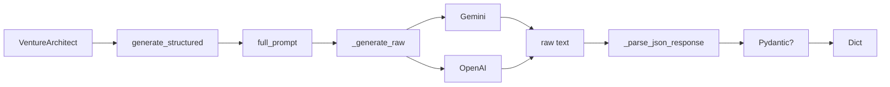

# Knowledge: AI Client (ai_client.py)

**Entry Point:** `src/ai_client.py` (AIClient)  
**Analysis Date:** 2026-02-12  
**Depth:** Medium  
**Focus:** LLM wrapper for Venture Architect, Gemini/OpenAI, structured JSON

---

## Overview

`AIClient` is a thin LLM wrapper used by `VentureArchitect`. It sends prompts and returns parsed JSON. No business logic — all intelligence is in the prompts. Supports Gemini (primary) and OpenAI (fallback).

**Primary use:** Phase 7 Venture Architect 3-stage pipeline (ICP, System Dynamics, EPS)

---

## Implementation Details

### Initialization

```python
AIClient(provider="gemini", model="gemini-2.0-flash", api_key=None)
```

- **provider:** `"gemini"` or `"openai"`
- **model:** e.g. `gemini-2.0-flash`, `gpt-4o-mini` (configurable via `settings.json`)
- **api_key:** Optional; otherwise `GEMINI_API_KEY` or `OPENAI_API_KEY` from env

**Raises:** `ValueError` if no API key; `ImportError` if provider package not installed.

### Main Method: `generate_structured`

```python
generate_structured(
    system_prompt: str,
    user_prompt: str,
    response_schema: Optional[Dict] = None,   # Unused (Gemini SDK limitation)
    response_model: Optional[Type[T]] = None,
    temperature: float = 0.3,
    max_tokens: int = 4096,
) -> Dict[str, Any]
```

**Flow:**
1. Concatenate `system_prompt` + separator + `user_prompt`
2. Call `_generate_raw()` (Gemini or OpenAI)
3. Retry up to 3× on `ValueError` / `JSONDecodeError`
4. Parse JSON via `_parse_json_response()`
5. If `response_model` given, validate with Pydantic and return `model_dump()`

**Returns:** Parsed JSON dict (or Pydantic-validated dict)

### JSON Parsing

`_parse_json_response(raw_text)`:
- Strips markdown code fences (````json ... ````)
- `json.loads()` on inner content
- **Raises:** `ValueError` on empty or invalid JSON

### Gemini Integration

- **SDK:** `google-generativeai`
- **Config:** `response_mime_type="application/json"` for JSON mode
- **Note:** Deprecated SDK does not support `$defs` in schema; we rely on prompt + Pydantic validation

### OpenAI Integration

- **SDK:** `openai` (OpenAI client)
- **Messages:** Single user message (system + user concatenated)

### Retry Logic (tenacity)

- 3 attempts
- Exponential backoff: 2–10 seconds
- Retries on: `ValueError`, `json.JSONDecodeError`

---

## Dependencies

### Upstream
- `os.getenv("GEMINI_API_KEY")` or `OPENAI_API_KEY`
- `settings.json` → `venture_architect.llm_model` (passed by main.py)

### Internal
- `tenacity` — retry
- `google.generativeai` — Gemini (optional)
- `openai` — OpenAI (optional)
- `pydantic` — validation when `response_model` used

### Downstream
- `VentureArchitect` — sole consumer; calls for each of 3 stages

---

## Visual Diagram



---

## Error Handling

| Case | Behavior |
|------|----------|
| Empty API key | `ValueError` at init |
| Invalid JSON after retries | `ValueError` |
| Pydantic validation failure | `ValueError` |
| Empty LLM response | `ValueError` |

---

## Metadata

| Field | Value |
|-------|-------|
| Entry Point | src/ai_client.py |
| Class | AIClient |
| Lines | ~210 |
| Related | knowledge-app-volatility-pipeline.md, knowledge-venture-architect |

---

## Next Steps

- Migrate to `google.genai` when deprecated SDK is phased out
- Add `response_schema` support if new Gemini SDK supports `$defs`
