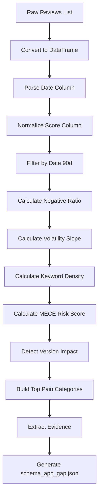

# Knowledge: Analyzer Module

## Overview

The `Analyzer` class is the core statistical analysis engine of the App Store Volatility Analyzer. It performs deterministic analysis on review data using Pandas and NumPy, implementing a MECE (Mutually Exclusive, Collectively Exhaustive) risk scoring methodology.

**Purpose:** Transform raw review data into actionable risk metrics through:
- Pain keyword detection (bilingual support)
- Volatility trend analysis (predictive)
- MECE pillar-based risk scoring (prescriptive)
- Version impact detection

**Language:** Python 3.9+
**Key Technologies:** Pandas, NumPy, regex
**Architecture Pattern:** Deterministic statistical analysis (no LLM/ML)

## Implementation Details

### Class Structure

```python
class Analyzer:
    def __init__(pain_keywords_path, settings)
    def load_pain_keywords(config_path)
    def filter_by_date(df, days_back=90)
    def calculate_slope(df)
    def _identify_pain_keyword_reviews(df)
    def calculate_keyword_density(df)
    def _get_mece_pillar_mapping()
    def _calculate_pillar_densities(category_counts, total_reviews)
    def calculate_risk_score(slope, volatility_score, category_counts, total_reviews)
    def analyze(reviews, app_name, days_back=90)
    def _empty_analysis_result(app_name)
    def save_analysis(analysis_result, output_path)
```

### Core Pipeline: `analyze()` Method

The main orchestration method follows a 13-step pipeline:



**Key Steps:**

1. **DataFrame Conversion:** Converts list of review dicts to Pandas DataFrame
2. **Date Normalization:** Handles multiple date column names (`date`, `reviewDate`, `createdAt`, `updatedAt`)
3. **Score Normalization:** Handles multiple score column names (`score`, `rating`, `starRating`, `stars`)
4. **Date Filtering:** Vectorized filtering to last N days (default 90)
5. **Negative Ratio:** Counts reviews with pain keywords (not just low-star reviews)
6. **Volatility Slope:** Linear regression on pain-keyword review trend
7. **Keyword Density:** Vectorized regex matching across all categories
8. **MECE Risk Score:** Pillar + Boost formula (see below)
9. **Version Impact:** Detects broken updates (>30% of negatives in one version)
10. **Top Pain Categories:** Sorted by impact (count × weight)
11. **Evidence:** Sample reviews (top 5 by text length)
12. **Schema Generation:** Builds `schema_app_gap.json` structure

### MECE Risk Scoring Formula (T-012)

The risk score uses a **Pillar + Boost** methodology:

#### Step A: Map Categories to MECE Pillars

```python
Functional Risk: critical, performance, privacy
Economic Risk: scam_financial, subscription, ads
Experience Risk: usability, competitor_mention, generic_pain
```

#### Step B: Calculate Pillar Density

For each pillar:
$$Density = \frac{\sum \text{Weights of Matching Keywords}}{\text{Total Reviews Analyzed}}$$

**Implementation:**
- Sums category weights for all matching reviews
- Divides by total review count
- Returns density for each of the three pillars

#### Step C: Calculate Base Risk Score

$$BaseScore = (\text{FunctionalDensity} + \text{EconomicDensity} + \text{ExperienceDensity}) \times 10.0$$

**Scaler Logic:** The 10.0 multiplier standardizes so that ~1 major pain point per user = 100.

#### Step D: Apply Volatility Boost

$$FinalRisk = \min(100.0, BaseScore \times (1 + \max(0, VolatilitySlope)))$$

**Logic:**
- If slope > 0 (getting worse): Amplifies score proportionally
- If slope ≤ 0 (improving/stable): Base score remains unchanged
- Capped at 100.0

**Example:**
- Base Score: 27.70
- Volatility Slope: 0.5714 (positive = worsening)
- Boost: 1.5714
- Final Risk: 43.54

### Key Methods

#### `calculate_slope(df)` - Predictive Analytics

**Purpose:** Calculate trend direction of pain-keyword reviews over time.

**Algorithm:**
1. Identify reviews containing pain keywords (any category)
2. Set date as index and resample by week
3. Count pain-keyword reviews per week
4. Fit linear regression: `np.polyfit(week_indices, counts, deg=1)`
5. Return slope coefficient

**Edge Cases:**
- Returns 0.0 if < 2 reviews
- Returns 0.0 if < 2 weeks of data
- Handles invalid dates gracefully

**T-011 Fix:** Uses pain-keyword reviews instead of traditional 1-2 star reviews (handles "Irony Paradox" where 5-star reviews contain complaints).

#### `_identify_pain_keyword_reviews(df)` - Negative Review Detection

**Purpose:** Identify reviews containing any pain keywords (redefines "negative").

**Algorithm:**
1. Combine title + text (if both exist)
2. Create regex pattern from ALL keywords across ALL categories
3. Vectorized matching: `str.contains(pattern, case=False, regex=True)`
4. Return boolean Series

**Key Insight:** This handles the "Irony Paradox" where users give 5-star ratings but complain heavily in the text.

#### `calculate_keyword_density(df)` - Prescriptive Analytics

**Purpose:** Count reviews matching each pain category.

**Algorithm:**
1. For each category in `pain_keywords.json`:
   - Create regex pattern from category keywords
   - Vectorized matching: `str.count(pattern)`
   - Count reviews with at least one match
2. Return dict: `{category_name: count}`

**Performance:** Uses Pandas vectorized operations (no Python loops).

#### `_calculate_pillar_densities()` - MECE Aggregation

**Purpose:** Aggregate category counts into MECE pillar densities.

**Algorithm:**
1. Map each category to its pillar (Functional/Economic/Experience)
2. Sum weights: `pillar_weights[pillar] += count × category_weight`
3. Calculate density: `weights / total_reviews`
4. Return dict: `{pillar_name: density}`

### Output Schema: `schema_app_gap.json`

```json
{
  "app_name": "Opal_Screen_Time",
  "analysis_date": "2026-02-09",
  "metrics": {
    "total_reviews_90d": 305,
    "negative_ratio": 0.266,
    "volatility_slope": 0.5714,
    "risk_score": 43.54
  },
  "signals": {
    "broken_update_detected": false,
    "suspected_version": null,
    "top_pain_categories": [...],
    "pillar_densities": {
      "Functional": 1.4918,
      "Economic": 1.1803,
      "Experience": 0.0984
    },
    "primary_pillar": "Functional"
  },
  "evidence": [...]
}
```

## Dependencies

### Direct Dependencies

**Python Standard Library:**
- `json` - Load pain keywords config
- `logging` - Structured logging
- `re` - Regex pattern matching
- `datetime`, `timezone`, `timedelta` - Date handling
- `typing` - Type hints
- `pathlib.Path` - File path handling

**External Packages:**
- `pandas` - DataFrame operations, vectorized text matching
- `numpy` - Linear regression (`np.polyfit`)

### Configuration Dependencies

**Files:**
- `config/pain_keywords.json` - Category definitions, keywords, weights
- `config/settings.json` - Weights (legacy, partially used)

**Schema:**
```json
{
  "categories": {
    "category_name": {
      "keywords": ["keyword1", "keyword2"],
      "weight": 10
    }
  }
}
```

### Upstream Dependencies

**Called By:**
- `main.py` - Orchestrates ETL pipeline
- Test scripts (`test_analyzer.py`)

**Data Flow:**
```
Fetcher.fetch_reviews() 
  → List[Dict] (raw reviews)
  → Analyzer.analyze()
  → Dict (schema_app_gap.json)
  → Analyzer.save_analysis()
  → JSON file
```

### Downstream Dependencies

**Used By:**
- `Reporter.aggregate_leaderboard()` - Reads `*_analysis.json` files
- Future: `Reporter.generate_report()` - Individual app reports

## Visual Diagrams

### Data Flow

```mermaid
graph LR
    A[Raw Reviews<br/>List[Dict]] --> B[DataFrame<br/>pandas]
    B --> C[Date Filter<br/>90 days]
    C --> D[Pain Keyword<br/>Detection]
    D --> E[Slope Calc<br/>np.polyfit]
    D --> F[Keyword Density<br/>Vectorized Regex]
    F --> G[Pillar Mapping<br/>MECE]
    G --> H[Risk Score<br/>Pillar + Boost]
    E --> H
    H --> I[schema_app_gap.json]
```

### MECE Pillar Calculation

```mermaid
graph TD
    A[Category Counts] --> B[Map to Pillars]
    B --> C[Functional<br/>critical, performance]
    B --> D[Economic<br/>scam_financial, subscription]
    B --> E[Experience<br/>usability]
    C --> F[Sum Weights]
    D --> F
    E --> F
    F --> G[Density = Weights / Total]
    G --> H[Base Score = Density × 10]
    H --> I[Boost = 1 + max(0, slope)]
    I --> J[Final Risk = Base × Boost]
```

## Error Handling

### Graceful Degradation

1. **Empty Reviews:** Returns `_empty_analysis_result()` with zeros
2. **Missing Columns:** Logs warning, uses defaults (date=now, score=3)
3. **Invalid Dates:** Drops rows with `dropna(subset=['date'])`
4. **Insufficient Data:** Returns 0.0 for slope if < 2 weeks
5. **Missing Config:** Logs warning, returns empty dicts

### Exception Handling

- `FileNotFoundError` - If `pain_keywords.json` missing
- `json.JSONDecodeError` - If config invalid JSON
- `np.linalg.LinAlgError` - If polyfit fails (returns 0.0)
- `ValueError` - If date parsing fails (coerced to NaT)

## Performance Considerations

### Vectorization

- **Text Matching:** Uses `pandas.str.contains()` and `str.count()` (vectorized)
- **Date Filtering:** Boolean indexing on datetime column
- **No Python Loops:** All operations use Pandas/NumPy vectorization

### Memory Efficiency

- **Copy-on-Write:** Uses `.copy()` only when needed
- **In-Place Operations:** Date normalization modifies DataFrame in-place
- **Early Filtering:** Drops invalid dates before expensive operations

### Scalability

- **Time Complexity:** O(n) for n reviews (vectorized operations)
- **Space Complexity:** O(n) for DataFrame storage
- **Bottleneck:** Regex pattern matching (mitigated by vectorization)

## Security Considerations

- **Input Validation:** Validates DataFrame structure before processing
- **Path Traversal:** Uses `pathlib.Path` for safe file operations
- **Regex Injection:** Escapes keywords with `re.escape()` before pattern creation
- **No Code Execution:** Pure statistical analysis, no eval/exec

## Testing

### Test Coverage Areas

1. **Empty Input:** Returns empty result structure
2. **Date Filtering:** Correctly filters to last N days
3. **Slope Calculation:** Handles edge cases (< 2 weeks, < 2 reviews)
4. **Keyword Matching:** Bilingual support (English/Vietnamese)
5. **MECE Formula:** Pillar mapping and density calculation
6. **Risk Score:** Normalization and boost application

### Test Files

- `test_analyzer.py` - Unit tests for Analyzer class
- Integration tests in `main.py` smoke test mode

## Known Limitations

1. **Fixed Pillar Mapping:** Hardcoded in `_get_mece_pillar_mapping()` (not configurable)
2. **Missing Categories:** Categories not in mapping default to no pillar
3. **Slope Precision:** Limited by weekly resampling granularity
4. **Evidence Selection:** Uses text length as proxy for "helpfulness" (not ideal)

## Future Improvements

1. **Configurable Pillars:** Move pillar mapping to `pain_keywords.json`
2. **Dynamic Categories:** Auto-detect new categories and assign to pillars
3. **Better Evidence:** Use review helpfulness votes (if available)
4. **Caching:** Cache keyword patterns for performance
5. **Parallel Processing:** Process multiple apps concurrently

## Related Documentation

- `docs/ai/design/apify-appstore-scraper.md` - System architecture
- `docs/ai/requirements/apify-appstore-scraper.md` - Requirements
- `docs/ai/implementation/phase3-summary.md` - Phase 3 implementation notes
- `docs/ai/planning/apify-appstore-scraper.md` - Task breakdown (T-006, T-007, T-011, T-012)

## Metadata

- **Analysis Date:** 2026-02-09
- **Entry Point:** `src/analyzer.py`
- **Class:** `Analyzer`
- **Dependency Depth:** 3 levels
- **Files Analyzed:** analyzer.py, config files, main.py
- **Key Contributors:** T-011 (Calibration), T-012 (MECE Scoring)

## Next Steps

1. **Documentation:** Add inline docstrings for all helper methods
2. **Testing:** Increase test coverage to 100%
3. **Refactoring:** Extract pillar mapping to config file
4. **Performance:** Profile regex operations for optimization
5. **Monitoring:** Add metrics for analysis execution time
