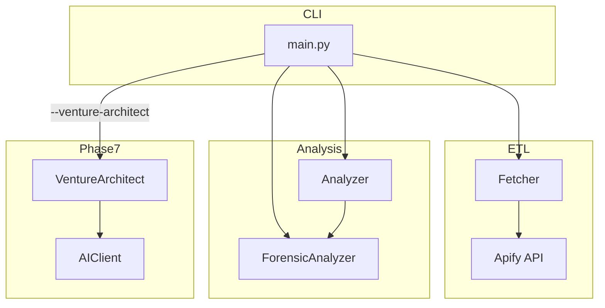
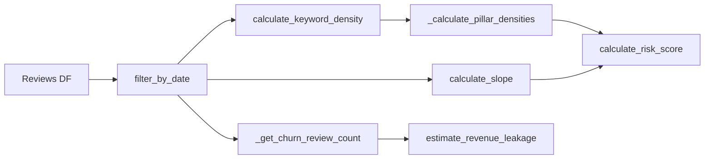
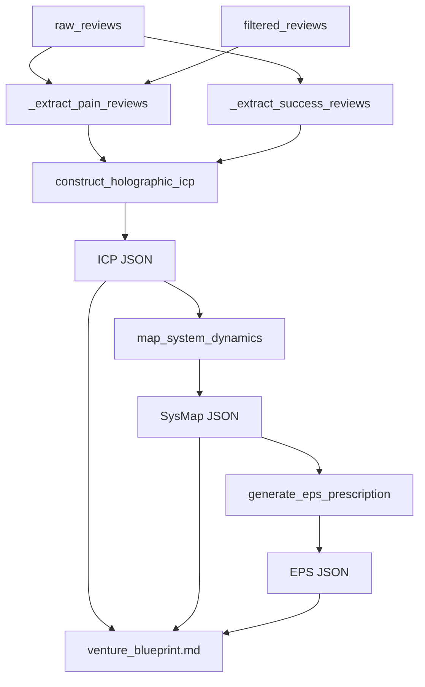

# Knowledge: App Volatility Pipeline

**Entry Points:** `main.py`, `src/analyzer.py`, `src/venture_architect.py`  
**Analysis Date:** 2026-02-12  
**Depth:** Medium  
**Focus:** Central capability, new features, recent refactors (T-031, metric coherence)

---

## Overview

The App Volatility Analyzer is a Python CLI ETL pipeline that:

1. **Fetches** App Store reviews via Apify `agents/appstore-reviews`
2. **Analyzes** reviews with deterministic stats (slope, keyword density, risk score)
3. **Forensics** timeline, semantic clusters, competitor migration
4. **Reports** Markdown intelligence reports
5. **Optionally** runs Venture Architect (Phase 7) for LLM-generated venture blueprints

**Language:** Python 3.11+  
**Key Libraries:** Pandas, NumPy, apify-client, tenacity, (optional) google-generativeai, pydantic, jinja2

---

## Implementation Details

### 1. Main Orchestrator (`main.py`)

**Purpose:** CLI entry point; loads config, initializes components, drives per-app processing.

**Key Flow:**

```
main()
  ├── Load configs (targets.json, pain_keywords.json, settings.json)
  ├── Init: Fetcher, Analyzer, Reporter, ForensicAnalyzer
  ├── For each app in targets_config["apps"]:
  │     ├── fetcher.fetch_reviews()      → reviews (raw)
  │     ├── fetcher.filter_reviews()     → filtered_reviews (drop 5★)
  │     ├── fetcher.save_reviews()
  │     ├── analyzer.analyze()           → analysis (schema_app_gap)
  │     ├── analyzer.save_analysis()
  │     ├── forensic_analyzer.run_forensic() → forensic
  │     ├── reporter.generate_report()
  │     └── [--venture-architect] venture_architect.generate_blueprint()
  └── [Batch] reporter.aggregate_leaderboard(), niche_report
```

**CLI Arguments:**

| Arg | Effect |
|-----|--------|
| `--smoke-test` | Limit to first app only; fail fast on error |
| `--venture-architect` | Lazy-init VentureArchitect; run 3-stage LLM pipeline |
| `--apify-token` | Override `APIFY_API_KEY` env |

**Environment:** `.env` loaded via `python-dotenv` (or manual fallback); `APIFY_API_KEY`, `GEMINI_API_KEY`.

**Error Handling:** `_json_default` for numpy/pandas scalars in `json.dump`; venture_architect failures logged, reraised in smoke mode.

---

### 2. Analyzer (`src/analyzer.py`)

**Purpose:** Deterministic statistical analysis. Produces `schema_app_gap` (risk score, pillar densities, Fermi leakage, slope delta).

**Core Methods:**

| Method | Purpose |
|--------|---------|
| `analyze(reviews, app_name, days_back, app_config)` | Main orchestrator; returns analysis dict |
| `filter_by_date(df, days_back)` | Vectorized 90-day cutoff |
| `calculate_slope(df)` | Linear regression on weekly pain-keyword counts |
| `calculate_slope_delta(df)` | T-021: Slope_T1 vs Slope_T2 for acceleration |
| `calculate_keyword_density(df)` | **Whale-weighted** per-category counts |
| `_get_churn_review_count(df)` | **Whale-weighted** churn (Economic + Functional) |
| `estimate_revenue_leakage(churn_reviews, price, niche_category)` | Fermi formula |
| `calculate_risk_score(slope, volatility_score, category_counts, total_reviews)` | T-031 Severity-First |

**T-031 Severity-First Risk Score:**

- **BaseScore:** `(Func×200) + (Econ×250) + (Exp×150)` — Economic weighted 2.5× vs UI
- **SlopeMultiplier:** `slope > 0 → min(2, 1+slope)`; `slope ≤ 0 → max(0.5, 1+slope×0.1)`
- **CriticalFloor:** `Econ>0.1 → 60`; `Func>0.15 → 50`; else 0
- **Final:** `min(100, max(CalculatedRisk, CriticalFloor))`

**Metric Coherence (Phase 6.5):** Whale reviews contribute 3× to density and churn. Constants from `ForensicAnalyzer.WHALE_MULTIPLIER`, `WHALE_DOMAIN_VOCAB`. Whale = >40 words OR domain vocab.

---

### 3. Venture Architect (`src/venture_architect.py`)

**Purpose:** 3-stage LLM pipeline for venture blueprint (Holographic ICP → 7-Node System Map → EPS Prescription).

**Data Signals:**

| Signal | Source | Extraction |
|--------|--------|------------|
| Pain | filtered_reviews | rating ≤ 2 |
| Success | raw_reviews | 5★ AND (>40 words OR domain vocab) |
| Context | reddit_data | (T-030 deferred; accepts []) |

**Core Methods:**

| Method | Purpose |
|--------|---------|
| `generate_blueprint(...)` | Orchestrate stages, save JSON + MD |
| `_extract_pain_reviews(filtered_reviews)` | rating ≤ 2 |
| `_extract_success_reviews(raw_reviews)` | 5★ whale (Forensic-consistent) |
| `construct_holographic_icp(...)` | Stage 1 → HolographicICP |
| `map_system_dynamics(...)` | Stage 2 → SystemDynamicsMap |
| `generate_eps_prescription(...)` | Stage 3 → EPSPrescription |
| `_repair_*_response(data)` | Coerce LLM output to Pydantic schema |

**Output Artifacts:**

- `reports/{niche}/{app}_system_map.json` — icp, system_dynamics, eps_prescription
- `reports/{niche}/venture_blueprint_{app}.md` — Jinja2-rendered strategy doc

**LLM:** Uses `AIClient` (Gemini default); model configurable via `settings.json` → `venture_architect.llm_model`.

---

## Dependencies

### Upstream (what the pipeline consumes)

| Source | Role |
|--------|------|
| `config/targets.json` | Apps, params, niche_name |
| `config/pain_keywords.json` | Keyword categories + weights |
| `config/settings.json` | Filters, weights, venture_architect.llm_model |
| `.env` | APIFY_API_KEY, GEMINI_API_KEY |

### Internal Module Dependencies

```
main.py
  ├── src.config_validator (load_json_config, validate_*)
  ├── src.fetcher (Fetcher)
  ├── src.analyzer (Analyzer)
  ├── src.reporter (Reporter)
  ├── src.intelligence (ForensicAnalyzer)
  └── [--venture-architect] src.ai_client, src.venture_architect

src/analyzer.py
  └── src.intelligence (ForensicAnalyzer) — WHALE_MULTIPLIER, WHALE_DOMAIN_VOCAB

src/venture_architect.py
  ├── src.ai_client (AIClient)
  ├── src.intelligence (ForensicAnalyzer) — WHALE_DOMAIN_VOCAB
  ├── src.reporter (Reporter)
  └── src.schemas (HolographicICP, SystemDynamicsMap, EPSPrescription)
```

### External Packages

- pandas, numpy — Analysis
- apify-client — Review fetch
- tenacity — Retry
- sklearn — N-Grams
- google-generativeai, pydantic — Venture Architect
- jinja2 — Blueprint template

---

## Visual Diagrams

### Pipeline Flow



### Analyzer → Risk Score



### Venture Architect 3-Stage



---

## Recent Refactors

| Refactor | Scope | Impact |
|----------|-------|--------|
| **T-031 Severity-First** | `calculate_risk_score` | Economic/Functional floors; slope dampens but never erases red flags |
| **Metric Coherence (Phase 6.5)** | `calculate_keyword_density`, `_get_churn_review_count`, `_extract_success_reviews` | Whale = 3×; unified with ForensicAnalyzer |
| **Configurable LLM** | `settings.json` | `venture_architect.llm_model` (e.g. gemini-2.5-flash) |

---

## Additional Insights

**Data Flow Nuance:** `main.py` passes **raw_reviews** (pre-filter) to VentureArchitect for success-signal extraction. Filtered reviews are used for pain signal and analysis.

**Whale Definition:** >40 words OR domain vocabulary (e.g. "latency", "workflow", "api", "subscription"). Single source: `ForensicAnalyzer.WHALE_DOMAIN_VOCAB`.

**Graceful Degradation:** VentureArchitect runs with `reddit_data=[]`; prompts adapt ("No Reddit data available").

---

## Metadata

| Field | Value |
|-------|-------|
| Entry Points | main.py, src/analyzer.py, src/venture_architect.py |
| Depth | Medium |
| Files Touched | 3 primary, + intelligence.py, ai_client.py, reporter.py |
| Related Docs | docs/ai/requirements/, docs/ai/design/ |

---

## Next Steps

- Run `/capture-knowledge` for `src/intelligence.py` (ForensicAnalyzer) for whale/timeline detail
- Run `/capture-knowledge` for `src/ai_client.py` for LLM wiring
- Add T-032 spec to planning if metric coherence doc is formalized
