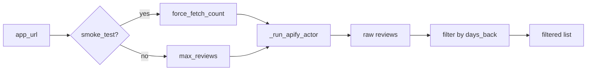

# Knowledge: Fetcher (fetcher.py)

**Entry Point:** `src/fetcher.py` (Fetcher)  
**Analysis Date:** 2026-02-12  
**Depth:** Medium  
**Focus:** Apify API, review fetch, filter, date handling

---

## Overview

`Fetcher` handles App Store review retrieval via the Apify `agents/appstore-reviews` actor. Responsibilities: connect with retry, fetch by URL/App ID, filter by date and rating, save to disk.

**Input:** App Store URL, config (days_back, max_reviews, smoke_test)  
**Output:** Raw and filtered review lists; optionally saved JSON

---

## Implementation Details

### Apify Actor

- **Actor ID:** `agents/appstore-reviews`
- **Alternative:** `thewolves/appstore-reviews-scraper` (documented fallback)
- **Run input:** `{maxItems, country, appIds | startUrls}`

### Key Methods

| Method | Purpose |
|--------|---------|
| `fetch_reviews(app_url, days_back, max_reviews, smoke_test)` | Main entry; returns date-filtered reviews |
| `filter_reviews(reviews)` | Thrifty filter; drop generic 5-stars |
| `save_reviews(reviews, output_path)` | Persist JSON |
| `_run_apify_actor(app_url, max_items)` | Call Apify with retry |
| `_extract_app_id(app_url)` | Parse ID from `/id12345` |
| `_parse_review_date(review)` | Parse `date`, `reviewDate`, etc. |

### Fetch Flow



### Filter Logic (filter_reviews)

**Config:** `settings.json` → `filters`:
- `min_star_rating` (default 4)
- `drop_generic_5_star` (default True)
- `min_review_length_words` (default 3)

**Rules:**
1. Drop if `rating < min_star_rating`
2. Drop if `word_count < min_review_length_words` and no critical keyword
3. **5-star handling:**
   - `min_star_rating == 5` → keep all 5-stars
   - `drop_generic_5_star` and `min_star_rating >= 4` → drop 5-stars unless they contain critical keywords
   - Critical keywords: `scam`, `crash`, `fraud`, `broken`, `error`, `bug`, etc.

### App ID Extraction

- **Pattern:** `/id(\d+)` at end of URL
- **Prefer:** `appIds: [id]` over `startUrls` for reliability
- **Fallback:** Use full URL if ID extraction fails

### Country / Region

- **Config:** `filters.country` (default `"us"`)
- **Values:** `"us"`, `"gb"`, `"all"`, etc.
- **Note:** `"all"` for niche apps with limited US reviews

### Retry (tenacity)

- 3 attempts on `ConnectionError`, `TimeoutError`
- Exponential backoff 2–10 seconds

---

## Dependencies

### Upstream
- `APIFY_API_KEY` env (or `apify_token` param)
- `config/settings.json` → `filters`

### Internal
- `apify_client`
- `tenacity`
- `datetime`, `timezone`

### Downstream
- `main.py` — calls `fetch_reviews`, `filter_reviews`, `save_reviews`

---

## Visual Diagram

```mermaid
flowchart TB
    Main[main.py] --> Fetch[fetch_reviews]
    Fetch --> Apify[Apify API]
    Apify --> Raw[Raw reviews]
    Raw --> Date[Date filter]
    Date --> Filter[filter_reviews]
    Filter --> Saved[save_reviews]
    Saved --> Data[data/{niche}/{app}_reviews.json]
```

---

## Error Handling

| Case | Behavior |
|------|----------|
| No API key | `ValueError` at init |
| Empty/invalid URL | `ValueError` in `_run_apify_actor` |
| Apify error item | Logged, skipped |
| Date parse failure | Review included (fail-open) |

---

## Metadata

| Field | Value |
|-------|-------|
| Entry Point | src/fetcher.py |
| Class | Fetcher |
| Lines | ~350 |
| Related | knowledge-app-volatility-pipeline.md |

---

## Next Steps

- Consider `fetcher_reddit.py` for Phase 7.3 Reddit context signal
