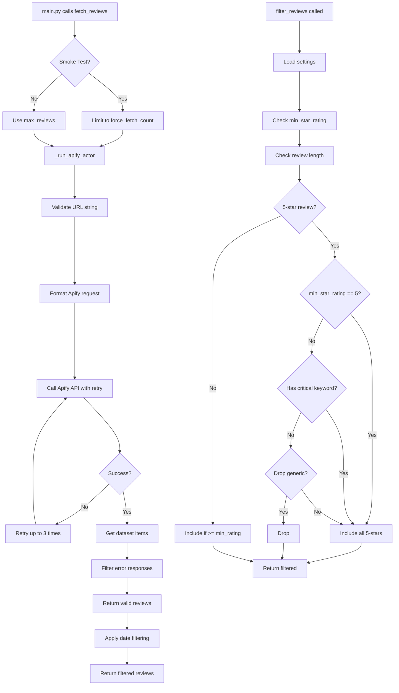
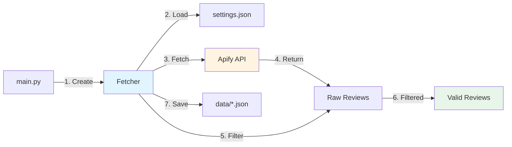
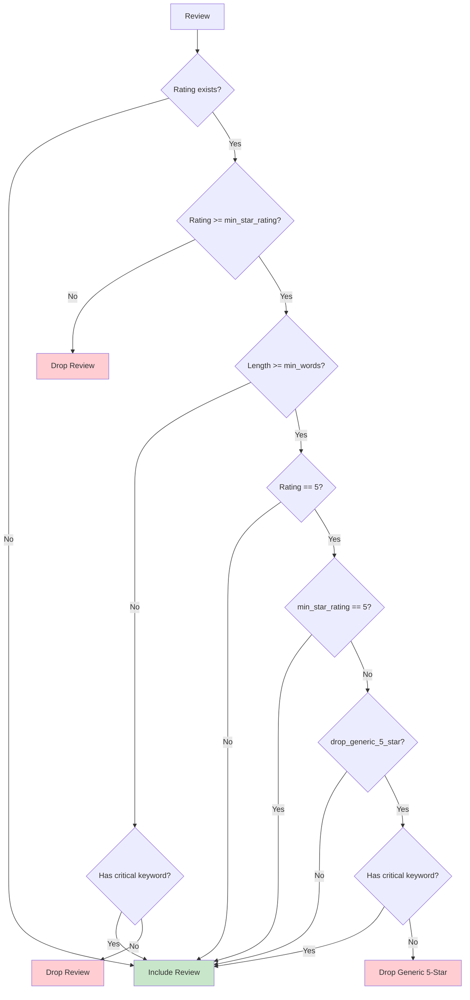

# Knowledge: Fetcher Module

## Overview

The `Fetcher` class is the core data acquisition component of the App Store Volatility Analyzer. It handles reliable fetching of App Store reviews from the Apify cloud platform, implements configurable filtering logic, and manages error handling with retry mechanisms.

**Purpose:** Bridge between the application and Apify's App Store Reviews Scraper actor, providing a fault-tolerant, configurable interface for retrieving and filtering review data.

**Language:** Python 3.9+

**Key Characteristics:**
- **Fault-Tolerant:** Uses Tenacity for automatic retry on network failures
- **Config-Driven:** Filtering behavior controlled via `settings.json`
- **Thrifty:** In-memory filtering to reduce storage (drops generic 5-star reviews)
- **Timezone-Aware:** Properly handles UTC datetime comparisons

## Implementation Details

### Core Responsibilities

1. **Apify API Integration**
   - Connects to `thewolves/appstore-reviews-scraper` actor
   - Manages API authentication via token (env var or parameter)
   - Formats requests correctly (array of URL strings, not objects)

2. **Reliable Data Fetching**
   - Implements retry logic with exponential backoff (3 attempts, 2-10s wait)
   - Handles connection/timeout errors gracefully
   - Filters out error responses from Apify (`{"error": true}` objects)

3. **Date Filtering**
   - Filters reviews to last N days (default: 90)
   - Handles timezone-aware datetime comparisons
   - Falls back to including reviews if date parsing fails

4. **Configurable Review Filtering**
   - Applies `min_star_rating` threshold from settings
   - Drops generic 5-star reviews (configurable via `drop_generic_5_star`)
   - Keeps 5-star reviews with critical keywords (scam, crash, etc.)
   - Enforces minimum review length (configurable)

5. **Data Persistence**
   - Saves filtered reviews to JSON files
   - Creates output directories as needed

### Key Methods

#### `__init__(apify_token, settings)`
- Initializes Apify client with authentication
- Loads filter configuration from settings
- Validates API token presence

#### `fetch_reviews(app_url, days_back, max_reviews, smoke_test)`
**Main public interface** for fetching reviews.
- Validates URL parameter
- Handles smoke test mode (limits to configured count)
- Calls `_run_apify_actor()` to fetch from Apify
- Applies date filtering (last N days)
- Returns filtered review list

#### `_run_apify_actor(app_url, max_items)`
**Private method** with retry decorator.
- Validates URL is string (not object)
- Formats Apify request correctly: `startUrls: ["url"]` (array of strings)
- Adds country code parameter (default: "us")
- Waits for actor completion
- Filters out error responses
- Returns valid reviews only

#### `filter_reviews(reviews)`
**Configurable filtering logic.**
- Applies `min_star_rating` threshold
- Drops reviews below minimum word count (unless critical keywords present)
- Special handling for 5-star reviews:
  - If `min_star_rating == 5`: Include ALL 5-star reviews
  - If `min_star_rating >= 4` and `drop_generic_5_star`: Drop generic 5-stars, keep critical ones
  - Otherwise: Include all 5-stars
- Returns filtered list with logging

#### Helper Methods
- `_parse_review_date()`: Handles multiple date formats (ISO, Unix timestamp)
- `_extract_rating()`: Extracts rating from various field names
- `_extract_review_text()`: Extracts text from various field names
- `save_reviews()`: Persists reviews to JSON file

### Execution Flow



## Dependencies

### External Packages
- **`apify_client`**: Official Apify Python client for API interactions
- **`tenacity`**: Retry library for fault-tolerant API calls
- **Standard Library**: `os`, `json`, `logging`, `typing`, `pathlib`, `datetime`

### Internal Dependencies
- **`settings.json`**: Configuration file for filter parameters
  - `filters.min_star_rating`: Minimum rating threshold
  - `filters.drop_generic_5_star`: Whether to drop generic 5-star reviews
  - `filters.min_review_length_words`: Minimum word count
  - `filters.force_fetch_count`: Smoke test limit

### Used By
- **`main.py`**: Main entry point that orchestrates the pipeline
  - Creates Fetcher instance with settings
  - Calls `fetch_reviews()` for each app
  - Calls `filter_reviews()` on fetched data
  - Calls `save_reviews()` to persist results

## Error Handling

### Retry Strategy
- **Decorator:** `@retry` from Tenacity
- **Max Attempts:** 3
- **Wait Strategy:** Exponential backoff (2-10 seconds)
- **Retry On:** `ConnectionError`, `TimeoutError`
- **Behavior:** Reraise exception after all retries exhausted

### Error Response Filtering
- Apify may return error objects: `{"error": true, "code": "C003", ...}`
- These are detected and filtered out before returning results
- Logged as warnings for debugging

### Validation Errors
- **Missing API Token:** Raises `ValueError` with clear message
- **Invalid URL Type:** Raises `ValueError` if not string
- **Empty URL:** Raises `ValueError` if URL is empty

### Graceful Degradation
- **Date Parsing Failure:** Includes review anyway (better safe than sorry)
- **Missing Rating:** Includes review (may be valid data)
- **Missing Text:** Treats as empty string, still processes

## Configuration

### Settings Integration
The Fetcher reads from `settings.json` filters section:

```json
{
  "filters": {
    "min_star_rating": 5,
    "min_review_length_words": 0,
    "drop_generic_5_star": true,
    "force_fetch_count": 100
  }
}
```

### Behavior Examples

**Example 1: Include all 5-star reviews**
```json
{"min_star_rating": 5, "drop_generic_5_star": true}
```
Result: ALL 5-star reviews included (special case logic)

**Example 2: Only critical reviews**
```json
{"min_star_rating": 4, "drop_generic_5_star": true}
```
Result: Ratings 4-5 included, but generic 5-stars dropped (keeps critical 5-stars)

**Example 3: All reviews**
```json
{"min_star_rating": 1, "drop_generic_5_star": false}
```
Result: All reviews included regardless of rating

## Performance Considerations

### Efficiency
- **In-Memory Filtering:** All filtering happens before disk write (thrifty)
- **Early Validation:** URL validation happens before API call
- **Error Filtering:** Removes invalid responses immediately

### Scalability
- **Batch Processing:** Can process multiple apps sequentially
- **Configurable Limits:** `max_reviews` parameter controls API usage
- **Smoke Test Mode:** Limits fetch count for testing

### Resource Usage
- **API Costs:** ~$0.10-0.20 per 1,000 reviews (Apify pricing)
- **Memory:** Minimal (processes reviews one at a time)
- **Network:** Retry logic may increase API calls on failures

## Security Notes

### API Token Management
- Token can be provided via:
  1. Constructor parameter
  2. `APIFY_API_KEY` environment variable
- Token is never logged or exposed in error messages

### Input Validation
- URL type checking prevents injection attacks
- String validation ensures proper formatting

## Known Issues & Limitations

### Current Limitations
1. **Country Code:** Hardcoded to "us" (can be overridden but not configurable)
2. **Critical Keywords:** Hardcoded list (should come from `pain_keywords.json`)
3. **Date Fields:** Assumes specific field names (may need expansion)

### Recent Fixes
1. **URL Format:** Fixed from `[{"url": "..."}]` to `["..."]` (Apify requirement)
2. **Timezone:** Fixed datetime comparison to use UTC-aware datetimes
3. **Error Responses:** Added filtering for Apify error objects

## Visual Diagrams

### Component Interaction



### Filter Logic Flow



## Additional Insights

### Design Patterns
- **Retry Pattern:** Tenacity decorator for fault tolerance
- **Strategy Pattern:** Configurable filtering via settings
- **Template Method:** `fetch_reviews()` orchestrates sub-methods

### Code Quality
- **Type Hints:** Full type annotations for better IDE support
- **Docstrings:** Comprehensive documentation for all public methods
- **Logging:** Structured logging at INFO/DEBUG/WARNING levels
- **Error Messages:** Clear, actionable error messages

### Testing Considerations
- **Mockable:** Apify client can be mocked for unit tests
- **Testable Logic:** Filter logic is pure function (easy to test)
- **Smoke Test Mode:** Built-in testing support via `force_fetch_count`

## Metadata

- **File:** `src/fetcher.py`
- **Lines of Code:** ~323
- **Classes:** 1 (`Fetcher`)
- **Public Methods:** 3 (`fetch_reviews`, `filter_reviews`, `save_reviews`)
- **Private Methods:** 4 (`_run_apify_actor`, `_parse_review_date`, `_extract_rating`, `_extract_review_text`)
- **Dependencies:** 2 external packages, standard library
- **Last Updated:** 2026-02-09 (after URL format and datetime fixes)

## Next Steps

### Potential Improvements
1. **Extract Critical Keywords:** Load from `pain_keywords.json` instead of hardcoding
2. **Country Code Config:** Make country code configurable via settings
3. **Date Field Expansion:** Support more date field variations from Apify
4. **Caching:** Add optional caching layer for repeated fetches
5. **Parallel Processing:** Support concurrent fetching for multiple apps

### Related Knowledge
- **`main.py`**: Entry point that uses Fetcher
- **`src/analyzer.py`**: Next step in pipeline (processes filtered reviews)
- **`config/settings.json`**: Configuration schema
- **`docs/ai/design/apify-appstore-scraper.md`**: Design documentation

### Follow-up Actions
- Consider capturing knowledge for `src/analyzer.py` once fully implemented
- Document Apify actor integration patterns for future reference
- Create integration test examples using mock Apify responses
