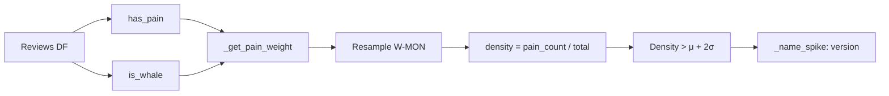
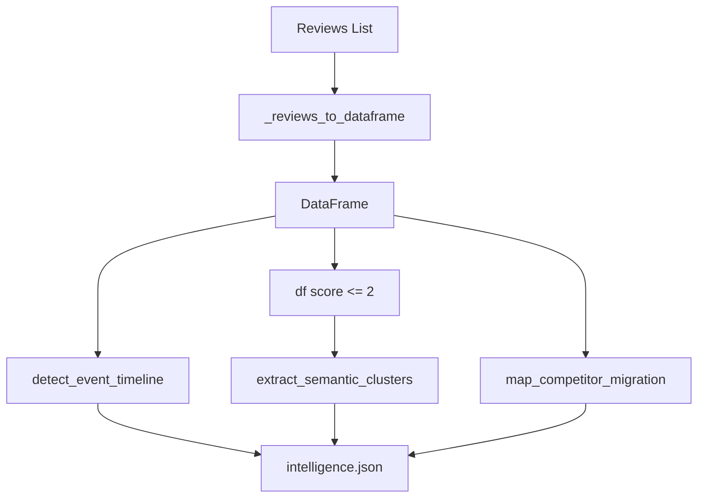

# Knowledge: Forensic Intelligence (intelligence.py)

**Entry Point:** `src/intelligence.py` (ForensicAnalyzer)  
**Analysis Date:** 2026-02-12  
**Depth:** Medium  
**Focus:** T-008 Forensic Intelligence, whale weighting, timeline, migration

---

## Overview

`ForensicAnalyzer` is the intermediate layer between raw stats (Analyzer) and Markdown reporting (Reporter). It derives meaning from review data: timelines of pain, semantic clusters, and competitor migration flows.

**Input:** List of review dicts (converted to DataFrame internally)  
**Output:** `intelligence.json` (timeline, clusters, migration), `niche_matrix.json` (Feature/Fail Matrix)

**Key Design:** Whale reviews (long or domain-specific) contribute 3× to pain density — single source of truth for `WHALE_MULTIPLIER` and `WHALE_DOMAIN_VOCAB` consumed by Analyzer and VentureArchitect.

---

## Implementation Details

### Core Constants

| Constant | Value | Purpose |
|----------|-------|---------|
| `WHALE_MULTIPLIER` | 3.0 | Pain weight for whale reviews |
| `WHALE_DOMAIN_VOCAB` | `{"latency", "vector", "workflow", ...}` | Terms that qualify as whale even if <40 words |
| `PILLAR_MAPPING` | category → Functional/Economic/Experience | MECE pillar assignment |
| `STOP_WORDS` | common English + generic praise | N-Gram filtering |

### Key Methods

| Method | Purpose |
|--------|---------|
| `run_forensic(reviews, app_name, competitors)` | Orchestrator; returns `{timeline, clusters, migration}` |
| `detect_event_timeline(reviews_df)` | Weekly pain density + anomaly (μ + 2σ); whale-weighted |
| `extract_semantic_clusters(text_series)` | N-Gram analysis; discovers unknown pain phrases |
| `map_competitor_migration(text_series, competitors)` | T-018: Churn only — "switched to X" |
| `generate_matrix(analyses)` | Build `{app: {pillar: score}}` for niche reports |

### Timeline of Pain (T-008 2.1)

- **Pain weight:** `1.0` (normal) or `3.0` (whale)
- **Whale:** >40 words OR contains `WHALE_DOMAIN_VOCAB`
- **Anomaly:** `density > rolling_mean + 2 * rolling_std`
- **Named Spike (T-022):** For anomaly weeks, most frequent `version` → "The Version X.X Spike"

### Semantic Clusters (T-008 2.2)

- **Library:** `sklearn.CountVectorizer` (or `collections.Counter` fallback)
- **Config:** `ngram_range=(2, 3)`, `min_df=2`, stop words = standard + app name tokens
- **Filter:** Excludes generic phrases ("good app", "love it")
- **Input:** 1-2★ review texts only

### Competitor Migration (T-018)

- **Strict regex:** `(switched|moved|migrated|changed) to {competitor}`
- **Ignores:** "better than X" (comparison, not churn)
- **Returns:** `[{competitor, type: "churn", count}]`

---

## Dependencies

### Upstream
- `config/pain_keywords.json` — pain keyword categories
- Reviews list (from main.py via Fetcher)

### Internal
- `pandas`, `numpy` — data handling
- `sklearn.feature_extraction.text.CountVectorizer` — optional
- `re` — regex for migration

### Downstream
- `main.py` — calls `run_forensic`
- `Reporter` — consumes timeline, clusters, migration
- `Analyzer`, `VentureArchitect` — import `WHALE_*` constants

---

## Visual Diagram

---

## Whale Definition (Canonical Source)

**Whale = >40 words OR contains domain vocabulary**

Domain vocab: `latency`, `vector`, `workflow`, `pipeline`, `integration`, `api`, `batch`, `export`, `sync`, `sync failed`, `credits`, `quota`, `render`, `4k`, `resolution`, `frame rate`.

`Analyzer` and `VentureArchitect` import these from `ForensicAnalyzer` for metric coherence.

---

## Metadata

| Field | Value |
|-------|-------|
| Entry Point | src/intelligence.py |
| Class | ForensicAnalyzer |
| Lines | ~460 |
| Related | knowledge-app-volatility-pipeline.md |

---

## Next Steps

- Run `/capture-knowledge` for `src/reporter.py` (consumes forensic output)
