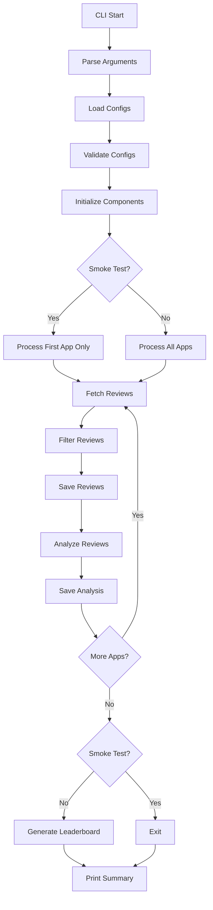
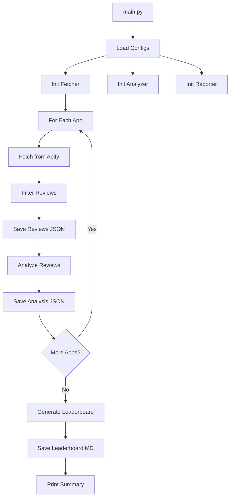
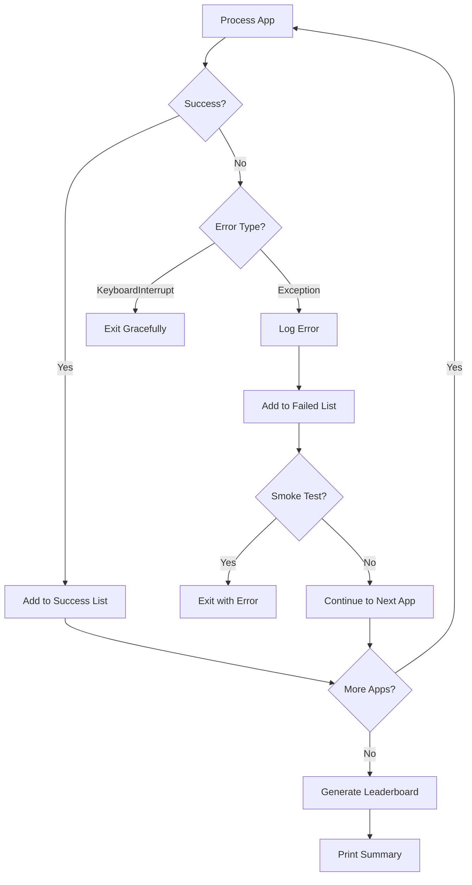

# Knowledge: Main ETL Pipeline

## Overview

`main.py` is the command-line entry point that orchestrates the complete App Store Volatility Analyzer ETL pipeline. It coordinates three core components (Fetcher, Analyzer, Reporter) to transform raw App Store reviews into actionable risk insights.

**Purpose:** Provide a single command-line interface for:
- Batch processing multiple apps from `targets.json`
- Configurable smoke test mode for development
- Robust error handling with graceful degradation
- Automatic leaderboard generation after batch processing

**Language:** Python 3.9+
**CLI Framework:** `argparse`
**Architecture Pattern:** ETL Pipeline Orchestration

## Implementation Details

### Entry Point Structure

```python
def main():
    # 1. Parse CLI arguments
    # 2. Load and validate configurations
    # 3. Initialize components (Fetcher, Analyzer, Reporter)
    # 4. Process each app in targets.json
    # 5. Generate leaderboard (if batch mode)
    # 6. Print summary
```

### Command-Line Interface

**Arguments:**
- `--smoke-test` (flag): Process only first app with limited reviews
- `--apify-token` (string): Apify API token (or use `APIFY_API_KEY` env var)

**Usage:**
```bash
# Batch processing (all apps)
python main.py

# Smoke test (first app only, limited reviews)
python main.py --smoke-test

# Custom API token
python main.py --apify-token YOUR_TOKEN
```

### Pipeline Flow



### Core Processing Loop

**For Each App:**

1. **Fetch Reviews** (`Fetcher.fetch_reviews()`)
   - Calls Apify API with app URL
   - Respects `smoke_test` mode (limits to configured count)
   - Returns raw review list

2. **Filter Reviews** (`Fetcher.filter_reviews()`)
   - Drops generic 5-star reviews (if configured)
   - Applies min_star_rating filter
   - Applies min_review_length_words filter
   - Returns filtered review list

3. **Save Reviews** (`Fetcher.save_reviews()`)
   - Saves to `data/{app_safe_name}_reviews.json`
   - Creates data directory if needed

4. **Analyze Reviews** (`Analyzer.analyze()`)
   - Calculates metrics (risk score, slope, negative ratio)
   - Generates MECE pillar insights
   - Returns `schema_app_gap.json` structure

5. **Save Analysis** (`Analyzer.save_analysis()`)
   - Saves to `data/{app_safe_name}_analysis.json`
   - Creates data directory if needed

**After All Apps:**

6. **Generate Leaderboard** (`Reporter.aggregate_leaderboard()`)
   - Scans `data/` for all `*_analysis.json` files
   - Ranks apps by risk score
   - Generates `data/market_leaderboard.md`

### Error Handling & Robustness (T-009)

**Per-App Error Handling:**

```python
try:
    # Process app
except KeyboardInterrupt:
    # User cancellation - exit gracefully
except Exception as e:
    # Log error, add to failed_apps, continue to next app
```

**Key Features:**

1. **Graceful Degradation:** Failed apps don't stop entire batch
2. **Progress Tracking:** Shows `[idx/total]` for each app
3. **Success/Failure Tracking:** Maintains lists of successful/failed apps
4. **Detailed Logging:** Full traceback for debugging (non-blocking)
5. **Smoke Test Fail-Fast:** In smoke test mode, exits on first error

**Final Summary:**

- Total apps processed
- Successful apps list
- Failed apps list (with error messages)
- Exit code: 0 (all success) or 1 (some failures)

### Configuration Loading

**Files Loaded:**

1. **`config/targets.json`**
   - List of apps to process
   - Global parameters (days_back, max_reviews, language)

2. **`config/pain_keywords.json`**
   - Pain category definitions
   - Keywords (bilingual support)
   - Category weights

3. **`config/settings.json`**
   - Filter settings (min_star_rating, drop_generic_5_star)
   - Weight settings (legacy, partially used)
   - Processing settings

**Validation:**

- `validate_targets_config()` - Ensures required fields exist
- `validate_pain_keywords_config()` - Ensures category structure
- `validate_settings_config()` - Ensures settings schema

**Error Handling:**

- Exits with code 1 if any config invalid
- Prints clear error messages

### Component Initialization

**Fetcher:**
```python
fetcher = Fetcher(
    apify_token=args.apify_token or os.getenv("APIFY_API_KEY"),
    settings=settings_config
)
```

**Analyzer:**
```python
analyzer = Analyzer(
    pain_keywords_path=config_dir / "pain_keywords.json",
    settings=settings_config
)
```

**Reporter:**
```python
reporter = Reporter()
```

**Error Handling:**

- Fetcher initialization failure exits immediately (API connection critical)
- Analyzer/Reporter failures handled in processing loop

## Dependencies

### Direct Dependencies

**Python Standard Library:**
- `sys` - Exit codes, path manipulation
- `os` - Environment variables
- `argparse` - CLI argument parsing
- `pathlib.Path` - File path handling
- `traceback` - Error logging

**Local Modules:**
- `src.config_validator` - Config loading and validation
- `src.fetcher` - Apify integration and review fetching
- `src.analyzer` - Statistical analysis and risk scoring
- `src.reporter` - Leaderboard generation

### Configuration Dependencies

**Required Files:**
- `config/targets.json` - App list and parameters
- `config/pain_keywords.json` - Category definitions
- `config/settings.json` - Filter and weight settings

**Optional:**
- `APIFY_API_KEY` environment variable (if `--apify-token` not provided)

### External Services

**Apify API:**
- Actor: `thewolves/appstore-reviews-scraper`
- Requires API token (CLI arg or env var)
- Network-dependent (handled with retries in Fetcher)

## Visual Diagrams

### Complete ETL Pipeline



### Error Handling Flow



## Error Handling

### Configuration Errors

- **Invalid JSON:** Exits immediately with error message
- **Missing Files:** Exits immediately with FileNotFoundError
- **Schema Validation:** Exits immediately with validation error

### Component Initialization Errors

- **Fetcher:** Exits immediately (API connection critical)
- **Analyzer/Reporter:** Handled in processing loop

### Processing Errors

- **Per-App Errors:** Logged, added to failed_apps, continue processing
- **KeyboardInterrupt:** Graceful exit with progress summary
- **Smoke Test Mode:** Fail-fast on first error

### Leaderboard Generation Errors

- **No Analysis Files:** Creates empty leaderboard with message
- **Invalid JSON:** Logs warning, skips file, continues
- **Generation Failure:** Logs error, prints traceback, continues

## Performance Considerations

### Sequential Processing

- **Current:** Processes apps sequentially (one at a time)
- **Bottleneck:** Apify API calls (network latency)
- **Mitigation:** Retry logic in Fetcher (tenacity)

### Scalability

- **Time Complexity:** O(n × m) where n = apps, m = reviews per app
- **Space Complexity:** O(m) per app (reviews loaded into memory)
- **Limitation:** Sequential processing limits throughput

### Optimization Opportunities

1. **Parallel Processing:** Process multiple apps concurrently
2. **Async/Await:** Use async Apify client for better I/O
3. **Caching:** Cache analysis results if reviews unchanged
4. **Streaming:** Stream large review sets instead of loading all

## Security Considerations

- **API Token:** Accepts via CLI arg or env var (not hardcoded)
- **Path Traversal:** Uses `pathlib.Path` for safe file operations
- **Input Validation:** Validates all config files before processing
- **Error Messages:** Doesn't expose sensitive info in error messages

## Testing

### Test Modes

1. **Smoke Test:** `--smoke-test` flag limits to first app
2. **Full Batch:** Processes all apps in `targets.json`
3. **Error Scenarios:** Test with invalid configs, API failures

### Test Files

- Integration tests: Run `main.py` with `--smoke-test`
- Manual testing: Process real apps and verify outputs

## Known Limitations

1. **Sequential Processing:** No parallel processing (slow for many apps)
2. **No Resume:** Can't resume from failure point (must restart)
3. **No Progress Persistence:** Progress lost on interruption
4. **Fixed Output Location:** Always saves to `data/` directory

## Future Improvements

1. **Parallel Processing:** Process multiple apps concurrently
2. **Resume Capability:** Save progress and resume from checkpoint
3. **Progress Bar:** Show progress bar for long-running batches
4. **Configurable Output:** Allow custom output directory
5. **Dry Run Mode:** Preview what would be processed without executing
6. **Incremental Updates:** Only process apps with new reviews

## Related Documentation

- `docs/ai/implementation/knowledge-fetcher.md` - Fetcher module details
- `docs/ai/implementation/knowledge-analyzer.md` - Analyzer module details
- `docs/ai/implementation/knowledge-reporter.md` - Reporter module details
- `docs/ai/planning/apify-appstore-scraper.md` - Task breakdown (T-009)
- `docs/ai/design/apify-appstore-scraper.md` - System architecture

## Metadata

- **Analysis Date:** 2026-02-09
- **Entry Point:** `main.py`
- **Function:** `main()`
- **Dependency Depth:** 3 levels
- **Files Analyzed:** main.py, config_validator.py, fetcher.py, analyzer.py, reporter.py
- **Key Contributors:** T-009 (Loop Robustness), T-010 (Leaderboard Integration)

## Next Steps

1. **Parallel Processing:** Implement concurrent app processing
2. **Progress Persistence:** Add checkpoint/resume functionality
3. **Testing:** Add comprehensive integration tests
4. **CLI Enhancements:** Add more command-line options (output dir, filters)
5. **Monitoring:** Add execution time metrics and logging
