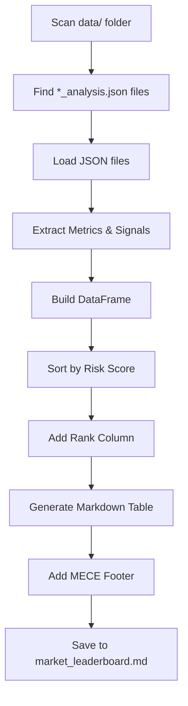
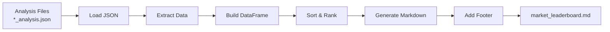
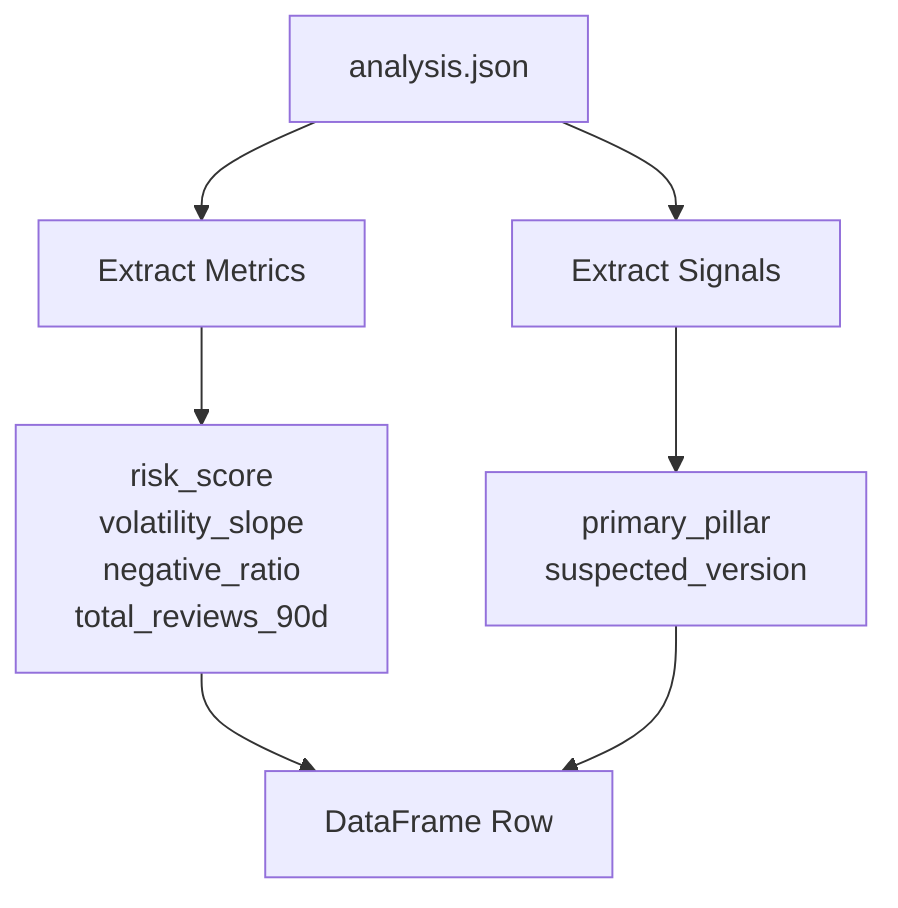

# Knowledge: Reporter Module

## Overview

The `Reporter` class generates human-readable markdown reports from analysis results. Its primary responsibility is creating the **Market Leaderboard** - a ranked comparison table of all analyzed apps with MECE pillar insights.

**Purpose:** Transform analysis JSON files into actionable business intelligence:
- Ranked comparison of apps by risk score
- MECE pillar-based insights
- Educational reporting with methodology explanations
- Future: Individual app reports (T-008)

**Language:** Python 3.9+
**Key Technologies:** Pandas, Markdown generation
**Architecture Pattern:** Report generation from structured data

## Implementation Details

### Class Structure

```python
class Reporter:
    def __init__(output_dir=None)
    def generate_executive_summary(analysis)  # TODO: T-008
    def generate_evidence_section(analysis)   # TODO: T-008
    def generate_raw_data_sample(reviews, top_n)  # TODO: T-008
    def generate_report(app_name, analysis, reviews)  # TODO: T-008
    def aggregate_leaderboard(data_dir=None)  # ✅ T-010, T-012
    def _generate_leaderboard_markdown(df, total_apps)  # ✅ T-012
    def _create_empty_leaderboard(data_dir)  # ✅ T-010
```

### Core Method: `aggregate_leaderboard()`

The main method orchestrates leaderboard generation:



**Key Steps:**

1. **File Discovery:** Uses `glob("*_analysis.json")` to find all analysis files
2. **Data Loading:** Loads JSON files with error handling (skips invalid files)
3. **Data Extraction:** Extracts metrics and signals from each analysis:
   - Risk score, volatility slope, negative ratio, volume
   - Primary pillar, suspected version (T-012 enhancements)
4. **DataFrame Construction:** Builds Pandas DataFrame for easy manipulation
5. **Ranking:** Sorts by risk_score (descending) and adds rank column
6. **Markdown Generation:** Calls `_generate_leaderboard_markdown()`
7. **File Output:** Saves to `data/market_leaderboard.md`

### Enhanced Leaderboard Columns (T-012)

The leaderboard includes 8 columns:

| Column | Description | Source |
|--------|-------------|--------|
| **Rank** | Sequential ranking (1, 2, 3...) | Calculated |
| **App Name** | Normalized app name | `analysis.app_name` |
| **Risk Score** | MECE risk score (0-100) | `metrics.risk_score` |
| **Vol. Slope** | Trend direction (per week) | `metrics.volatility_slope` |
| **Neg. Ratio (%)** | % reviews with pain keywords | `metrics.negative_ratio` |
| **Volume** | Total reviews analyzed | `metrics.total_reviews_90d` |
| **Primary Pillar** | MECE pillar with highest density | `signals.primary_pillar` |
| **Suspected Version** | Version with spike (if detected) | `signals.suspected_version` |

### Markdown Generation: `_generate_leaderboard_markdown()`

**Structure:**

1. **Header:** Title, generation timestamp, total apps analyzed
2. **Table:** 8-column markdown table with all apps ranked
3. **MECE Methodology Section:** Explains the three pillars
4. **Risk Score Calculation:** Formula breakdown
5. **Column Definitions:** Detailed explanations
6. **Risk Score Ranges:** Interpretation guide

**MECE Pillar Explanation:**

The footer educates users on:
- **Functional Risk:** Technical issues (crashes, bugs, performance)
- **Economic Risk:** Financial concerns (scam, subscription, ads)
- **Experience Risk:** Usability and competitive positioning

**Formula Explanation:**

```
Base Score = (FunctionalDensity + EconomicDensity + ExperienceDensity) × 10.0
Final Risk = BaseScore × (1 + max(0, VolatilitySlope))
```

## Dependencies

### Direct Dependencies

**Python Standard Library:**
- `json` - Load analysis JSON files
- `logging` - Structured logging
- `typing` - Type hints
- `pathlib.Path` - File path handling
- `datetime` - Timestamp generation

**External Packages:**
- `pandas` - DataFrame operations for sorting and ranking

### Configuration Dependencies

**None** - Reporter is read-only, consumes analysis files

### Upstream Dependencies

**Data Source:**
- `data/*_analysis.json` - Analysis files generated by `Analyzer.save_analysis()`

**Schema Expected:**
```json
{
  "app_name": "...",
  "metrics": {
    "risk_score": 43.54,
    "volatility_slope": 0.5714,
    "negative_ratio": 0.266,
    "total_reviews_90d": 305
  },
  "signals": {
    "primary_pillar": "Functional",
    "suspected_version": null
  }
}
```

### Downstream Dependencies

**Output:**
- `data/market_leaderboard.md` - Markdown file for human consumption

**Future:**
- `Reporter.generate_report()` - Individual app reports (T-008)

## Visual Diagrams

### Leaderboard Generation Flow



### Data Extraction



## Error Handling

### Graceful Degradation

1. **No Analysis Files:** Returns empty leaderboard with helpful message
2. **Invalid JSON:** Logs warning, skips file, continues processing
3. **Missing Fields:** Uses defaults (0.0 for metrics, "None" for strings)
4. **Empty DataFrame:** Handles gracefully with empty table

### Exception Handling

- `FileNotFoundError` - Handled by glob (returns empty list)
- `json.JSONDecodeError` - Caught, logged, file skipped
- `KeyError` - Handled with `.get()` defaults

## Performance Considerations

### File I/O

- **Sequential Reading:** Reads all analysis files sequentially (acceptable for < 50 apps)
- **Memory:** Loads all analyses into memory (acceptable for typical use case)

### Scalability

- **Time Complexity:** O(n log n) for sorting n apps
- **Space Complexity:** O(n) for DataFrame storage
- **Bottleneck:** File I/O (mitigated by small file count)

### Optimization Opportunities

1. **Parallel Reading:** Could read JSON files in parallel for large datasets
2. **Streaming:** Could stream large leaderboards if needed
3. **Caching:** Could cache leaderboard if analysis files unchanged

## Security Considerations

- **Path Traversal:** Uses `pathlib.Path` for safe file operations
- **Input Validation:** Validates JSON structure before processing
- **No Code Execution:** Pure markdown generation, no template injection

## Testing

### Test Coverage Areas

1. **Empty Directory:** Returns empty leaderboard
2. **Invalid JSON:** Skips invalid files gracefully
3. **Missing Fields:** Uses defaults correctly
4. **Sorting:** Ranks apps correctly by risk score
5. **Markdown Format:** Generates valid markdown table

### Test Files

- Integration tests in `main.py` (leaderboard generation after batch processing)

## Known Limitations

1. **Fixed Columns:** Column structure hardcoded (not configurable)
2. **No Filtering:** Shows all apps (no option to filter by risk threshold)
3. **No Export:** Only generates markdown (no CSV/JSON export)
4. **Single Format:** Only one leaderboard format (no customization)

## Future Improvements (T-008)

1. **Individual Reports:** `generate_report()` for per-app markdown reports
2. **Executive Summary:** High-level insights section
3. **Evidence Section:** Pain clusters and version impact details
4. **Raw Data Sample:** Top negative reviews
5. **Export Formats:** CSV, JSON, PDF options
6. **Filtering:** Filter by risk score, pillar, volume
7. **Visualizations:** Charts/graphs for trends

## Related Documentation

- `docs/ai/implementation/knowledge-analyzer.md` - Analyzer module (generates input data)
- `docs/ai/planning/apify-appstore-scraper.md` - Task breakdown (T-010, T-012)
- `docs/ai/design/apify-appstore-scraper.md` - System architecture

## Metadata

- **Analysis Date:** 2026-02-09
- **Entry Point:** `src/reporter.py`
- **Class:** `Reporter`
- **Dependency Depth:** 2 levels
- **Files Analyzed:** reporter.py, analyzer.py (for schema understanding)
- **Key Contributors:** T-010 (Aggregate Leaderboard), T-012 (MECE Enhancements)

## Next Steps

1. **T-008 Implementation:** Complete `generate_report()` for individual app reports
2. **Testing:** Add unit tests for markdown generation
3. **Export Options:** Add CSV/JSON export functionality
4. **Filtering:** Add risk threshold filtering
5. **Visualizations:** Consider adding charts/graphs
